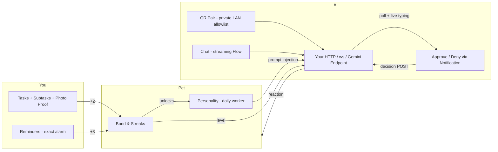
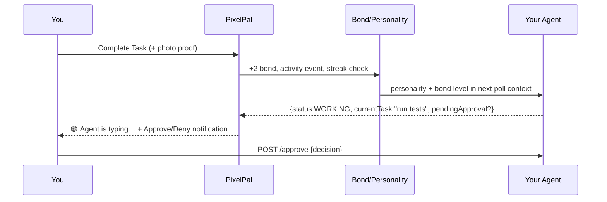

# PixelPal — Your AI Companion on Android

> **One pixel pet, one story — powered by an AI agent you connect yourself.**
> PixelPal is not a todo app with a sticker. It's a **single-companion OS** where your tasks, reminders, and streaks *are the pet's life*. The main feature is the **AI agent connection** — you paste any HTTP/WebSocket/Gemini endpoint, the pet talks to it, and you approve what it does.

**Live Demo →** `https://github.com/riddhibantia/Pixel-Pal-` · **Package** `com.pixelpal.app` · **minSdk 26 / targetSdk 35** · **Kotlin 2.0 + Jetpack Compose**

---

## Summary — what the app actually is

PixelPal is a **single-companion** Android app. You get **one** pixel cat (Dog/Whale/Axolotl/Llama unlock as bond grows) for the entire install. Everything else is a feature *of that companion*:

- **Tasks + subtasks + photo proof** and **reminders with exact alarms** → they feed **Bond & streaks** (tasks +2, reminders +3, daily cap 3, 5-level milestones) → Bond unlocks **species** and evolves **personality** daily.
- **That bond/personality is what you show the AI** — the agent sees *your* companion's state and reacts in context ("You still have 3 tasks left").
- **Floating overlay, widgets, activity feed** — all read the same companion.

In one line: **your habits grow a pet that your AI talks through.**

---

## Why AI is the main feature (and why tasks/reminders exist at all)

Most todo apps bolt on a chatbot. PixelPal does the opposite — **the agent is the product, the habits are the fuel.**



**How it works in practice:**

1. **You connect an agent** — paste `https://your-agent/status` or `ws://192.168.1.10:8765` or a Gemini key. Or **Scan QR** on your laptop dashboard (CameraX + ML Kit). The app allowlists private LAN so `http://` works at home.
2. **The app polls / streams** — `GenericHttpAgentConnector` polls `{status, currentTask, progress, message, pendingApproval}` and `WebSocketAgentConnector` streams the same envelope over `ws://`. `AgentStatusWorker` runs every 15 min per `companionId` (battery-not-low, `NetworkType.CONNECTED`).
3. **It asks you, not just tells you** — when the envelope contains `pendingApproval`, you get a notification **Approve / Deny** (`AgentApprovalReceiver`). One `approvalId`, one notification, deduped via `PreferencesManager.lastApprovalId`.
4. **You talk back** — `sendCommand` POSTs `{"command": "..."}` to `commandUrl` or sends over the live socket. Gemini streams via `Flow<String>`.
5. **The pet reacts** — `CompanionReactionProvider` weaves live state into messages. Activity Center shows **🟢 Agent is typing…** when `currentStatus == WORKING` (live WebSocket typing indicator).

**Why tasks & reminders aren't just "features":**
- Without them, bond never moves, personality never evolves, streaks die, and the agent has nothing to react to.
- With them, every completed task is a **bond event** that also writes an `ActivityEvent` and pushes to Firestore — the same pipeline the agent reads. It's one loop: **Do → Bond → Personality → Agent context → Reaction**. That's why the app feels alive.

---

## ✨ Core features

- **AI Agent Connection** — Generic HTTP / WebSocket / Gemini, `WORKING/IDLE/ERROR/OFFLINE` UI, `Check Now`, QR-pair, notification gate, `FirestorePushWorker` retry queue (hourly full sync backup)
- **Tasks that matter** — `NewTask → TaskDetail` with **photo proof** (Coil, `TaskEntity.photoUri` v13, local-first), subtasks with drag-agnostic `sortOrder`, swipe-to-delete, progress bar, widget opt-in
- **Reminders that fire** — `AlarmManager` exact + `BootReceiver` + `ReminderActionReceiver`, snooze, status `PENDING → TRIGGERED → COMPLETED`
- **Bond & Streaks** — `BondEngine` caps taps at 3/day, feed/play are cosmetic, level every 5
- **Personality** — `PersonalityWorker` recomputes daily from activity
- **Overlay** — `SYSTEM_ALERT_WINDOW`, `MAX_SIMULTANEOUS_OVERLAYS=1`, draggable `OverlaySession`
- **Desktop widget** — `104×112` PyWebView (`mini_pet.py`) mirrors the same Lottie, `overflow:hidden`, `border-radius 12`
- **Single companion, enforced** — `CompanionBootstrapInitializer` folds legacy rows (activeId → favorite → most-recent) once, idempotent

---

## 🏗 Architecture

```
app/
 ├─ data/local/db/          Room v13 (Companion, Bond, Personality, Task+Subtask+photoUri, Reminder, AgentConnection, Activity)
 │   └─ DatabaseMigrations.kt  1→13 (photoUri is 12→13)
 ├─ data/local/datastore/   PreferencesManager + Bootstrap (SingleCompanionFold)
 ├─ data/remote/            GenericHttpAgentConnector, WebSocketAgentConnector, GeminiAgentConnector
 ├─ data/remote/firebase/   FirebaseAuth (anon + email), FirestoreSyncEngine + FirestorePushWorker + FirestoreSyncWorker
 ├─ domain/engine/          ActiveCompanionManager (the authority), BondEngine, ReactionProvider
 ├─ presentation/           Compose + LottiePetView (state→rawRes) + Home/Tasks/NewTask/TaskDetail(with ViewModel)/Reminders/Customize/Agent/QrScan/Activity
 ├─ overlay/                OverlayManager (1 session max)
 ├─ worker/                 AgentStatusWorker, PersonalityWorker, BondDecayWorker, FirestoreSyncWorker/PushWorker
 ├─ widget/                 TasksWidgetProvider, HomeWidgetProvider
 └─ di/                     Hilt
agent-endpoint/
 ├─ server.py               GET / → envelope, POST /approve, GET /mini (Lottie page)
 └─ mini_pet.py             floating 104×112 square
```

### System overview

```mermaid
graph TB
    UI[Compose UI] --> VM[ViewModels]
    VM --> Domain[ActiveCompanionManager / BondEngine]
    Domain --> Repo[Task/Reminder/Agent Repos]
    Repo --> DB[(Room v13)]
    Repo -->|push async + retry| FS[(Firestore users/{uid})]
    FS -->|snapshot| Repo
    Agent[Your Agent<br/>HTTP / WS / Gemini] -->|poll/stream + QR| Repo
    Agent --> Desk[Desktop mini_pet]
    Repo --> Overlay[OverlayService]
    Repo --> Widget[Widgets]
```

### Task → Bond → AI loop



---

## 🎬 60-second demo

1. Onboarding → Auth (guest)
2. Home — Lottie hero
3. Tasks → New Task → add subtasks → Create Task → appears instantly (Flow) → Task Detail → attach photo proof → tick subtasks → Complete (see bond bump)
4. Reminders → create exact alarm
5. Customize → unlock Llama at bond 60
6. AI Agent → paste endpoint or Scan QR → Check Now → see `Working` + live typing in Activity → Approve via notification
7. Overlay → float over any app

---

## 🔗 Live demo in your resume — how to show it without a Play Store build

You put `https://github.com/riddhibantia/Pixel-Pal-` in your resume. To make it **click → see it live**, add one of these next to the link:

**1. GitHub Releases APK (fastest, no store):**
```bash
./gradlew :app:assembleDebug
# upload app/build/outputs/apk/debug/app-debug.apk to:
# GitHub → Releases → Tag v1.1.0 → attach APK → link in README:
# [📲 Download APK](https://github.com/riddhibantia/Pixel-Pal-/releases/download/v1.1.0/app-debug.apk)
```
Recruiters tap → install on any Android 8+ device. Add that line under the title.

**2. Firebase App Distribution (looks most professional):**
```bash
firebase appdistribution:distribute app/build/outputs/apk/debug/app-debug.apk \
  --app 1:xxx:android:xxx --groups "recruiters" --release-notes "PixelPal v1.1.0 — AI companion"
# you get a https://appdistribution.firebase.google.com/testerapps/... invite link
# put: Live build → [Firebase App Distribution](your-link) (no Play review)
```

**3. Live web mini-demo (shows the AI widget without an Android device):**
Host `agent-endpoint/server.py` + `GET /mini` as a static page on GitHub Pages:
```bash
# copy agent-endpoint/server.py MINI_PAGE HTML to docs/mini.html
git add docs/mini.html && git push
# enable Settings → Pages → docs/ → https://riddhibantia.github.io/Pixel-Pal-/mini.html?species=cat
# put: [🟢 Live Widget Demo](https://riddhibantia.github.io/Pixel-Pal-/mini.html)
```

**4. 30s video (highest conversion for resumes):**
Record the flow above, upload as `docs/demo.mp4` or to YouTube unlisted, embed:
```md
[](https://youtu.be/YOUR_ID)
```
**Recommendation for your resume:** keep the GitHub link + add **one** of: `[APK](Releases)` *or* `[Live Widget](Pages)` + `[Video](YouTube)`. I can generate the Release tag and the `docs/mini.html` for Pages on the next push — say which you want and I'll wire it.

---

## 🛠 Tech stack

| Layer | Choice |
|---|---|
| Language / build | Kotlin 2.0, AGP 8.5, KSP, Java 17 |
| UI | Jetpack Compose (BOM), Material 3, Lottie Compose, Coil, Navigation Compose |
| DI / async | Hilt, Coroutines + Flow, WorkManager |
| Local | Room v13 (8 entities, exportSchema, photoUri 12→13), DataStore |
| Cloud | Firebase Auth (anon + email), Firestore (offline cache, `cloudId` UUID, `FirestorePushWorker` retry) |
| AI | Gemini `Flow<String>` + Generic HTTP + WebSocket (`OkHttp` + `WebSocketAgentConnector`) |
| Agent UX | CameraX + ML Kit (QR), `AgentNotificationHelper` Approve/Deny |
| Desktop | Python + PyWebView (`mini_pet.py` 104×112) |

---

## 🚀 Build & run

```bash
./gradlew :app:assembleDebug
./gradlew :app:installDebug
./gradlew :app:testDebugUnitTest   # 34 unit
./gradlew :app:lintDebug
./gradlew clean
# desktop widget
python agent-endpoint/server.py 8765
pythonw agent-endpoint/mini_pet.py cat
```

Needs JDK 17, SDK 35, `local.properties` with `GEMINI_API_KEY`, `app/google-services.json` (demo project `pixel-pet-a1cc6` — replace for a fork).

---

## 🧪 Tests & CI

- **Unit** `SpeciesRosterTest`, `ApprovalEnvelopeTest`, Bond
- **Instrumented** `MigrationTest 3→13` + `TaskDaoTest` + `ReminderDaoTest` + `NavSmokeTest`
- **CI** `.github/workflows/ci.yml` → `build ✅ / instrumented ✅ / rules ✅`
  - `build`: `assembleDebug` + `Room schema diff` + `testDebugUnitTest` + `lintDebug`
  - `instrumented`: `api 35 google_apis pixel_7_pro` + KVM + `900s` boot + `sys.boot_completed` check → `connectedDebugAndroidTest`

---

## 📄 Resume bullets

- **PixelPal — AI Companion App (Kotlin, Jetpack Compose, Firebase)** — Single-companion OS (Room v13, 12 migrations) where tasks/reminders/photo-proof feed Bond (daily cap 3, milestones every 5) and personality; offline-first Firestore sync with stable `cloudId` + WorkManager retry.
- **AI-first**: pluggable agent (HTTP / WebSocket live stream / Gemini), QR-pair for private LAN, polling worker per `companionId`, notification gate (`pendingApproval` → Approve/Deny), live typing banner in Activity Center.
- **Lottie as source of truth** — launcher icon sampled pixel-for-pixel from `pet_cat_idle.json` (`scale 82.08/400`); `104×112` desktop widget mirrors the same art.
- **34 unit + migration/DAO/espresso tests, CI with emulator api-35, schema diff guard.**

*One-liner:* `PixelPal — AI companion where habits grow a pet that your agent talks through (Compose + Room v13 + Firestore + WebSocket live typing).`

---

## 📸 Screenshots

```
docs/screenshots/home.png
docs/screenshots/tasks.png
docs/screenshots/new_task.png
docs/screenshots/mini_pet.png
```

---

## 👤 Author

**Riddhi Bantia** — `https://github.com/riddhibantia/Pixel-Pal-`

```
git clone https://github.com/riddhibantia/Pixel-Pal-.git
cd Pixel-Pal- && ./gradlew :app:assembleDebug
```

