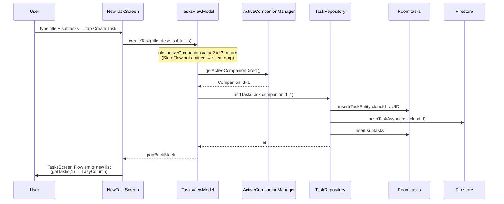
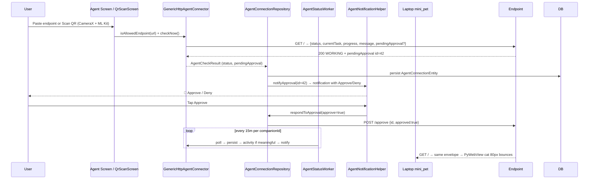

# PixelPal — Your Pixel Companion on Android

> A polished Android companion app where a single pixel pet lives on your screen, tracks your day, and connects to external AI agents. Built to be **resume-ready, production-grade, and demo-friendly**.

**Package:** `com.pixelpal.app` · **minSdk 26 / targetSdk 35** · **Kotlin 2.0 + Jetpack Compose** · **Single-module `:app`**

---

## ✨ What it does (30-second pitch)

PixelPal is a **single-companion** app (one pet, never many). Everything — tasks, reminders, streaks, bond, personality, activity feed, notifications, overlay, and AI-agent connection — is a feature *of that companion*.

- **One pet, for life** — square pixel cat (also Dog/Whale/Axolotl/etc. unlockable) rendered with **Lottie** and a matching launcher icon generated pixel-for-pixel from the Lottie frame
- **Tasks with subtasks** — create → break down → tick off. Progress bar, swipe-to-delete, widget opt-in
- **Reminders & alarms** — exact-alarm scheduling with `AlarmManager` + notification actions
- **Bond & streaks** — tap/play/feed, +2 per task / +3 per reminder, daily caps, milestones every 5 levels
- **Personality that evolves** — daily `PersonalityWorker` recomputes traits from activity
- **AI Agent connection** — poll a user-provided HTTP endpoint, show `WORKING / IDLE / ERROR / OFFLINE`, approve/deny via notification, **QR-pair** the endpoint
- **Floating overlay** — system overlay (`SYSTEM_ALERT_WINDOW`) with one active `OverlaySession`, draggable
- **Desktop companion widget** — tiny `104×112` floating window on your laptop that mirrors the agent status (same Lottie, same colors)

---

## 🎬 Demo flow (what a recruiter can tap in 60s)

1. **Onboarding → Auth** — guest (anonymous Firebase Auth) or email/password
2. **Home** — hero Lottie, greeting, stats, today chips
3. **Tasks → New Task** — title + optional description + any number of subtasks → **Create Task** → back to list, appears instantly (Flow + Room). Tap row → detail, tick subtasks, complete
4. **Reminders** — create, fires exact alarm
5. **Customize** — pick species (Cat/Dog/Whale/Axolotl/Llama … unlocks at bond levels)
6. **AI Agent** — paste endpoint or **Scan QR**, poll, approve/deny from notification
7. **Overlay** — enable, see pet float over any app

> **Task bug fixed:** `TasksViewModel.createTask` now falls back to `ActiveCompanionManager.getActiveCompanionDirect()` when the `StateFlow` hasn't emitted yet, so creation never silently drops.

---

## 🏗 Architecture

```
app/
 ├─ data/
 │   ├─ local/db/          Room v12 (Companion, Bond, Personality, Task+Subtask, Reminder, AgentConnection, Activity)
 │   │   └─ DatabaseMigrations.kt  (1→12, hand-written NOT NULL defaults)
 │   ├─ local/datastore/   DataStore PreferencesManager + CompanionBootstrapInitializer (SingleCompanionFold)
 │   └─ remote/firebase/   FirebaseAuthManager, FirestoreSyncEngine (users/{uid}/companion & tasks, offline cache)
 │   ├─ remote/            GenericHttpAgentConnector (polls {status,currentTask,progress,message}), GeminiAgentConnector
 ├─ domain/
 │   ├─ engine/            ActiveCompanionManager (single authority), BondEngine, CompanionReactionProvider
 │   ├─ usecase/           GetActiveCompanion, Add/Complete/GetTasks etc.
 │   └─ repository/        interfaces (Task, Reminder, Bond …)
 ├─ presentation/
 │   ├─ components/        LottiePetView (state→rawRes with drawable fallback), PetRenderer, EmptyState
 │   ├─ screens/           home, tasks (TasksScreen/NewTaskScreen/TaskDetail *with ViewModel*), reminders, customize, agent (QrScanScreen via CameraX+ML Kit), activity
 │   ├─ navigation/        NavGraph (Screen.Tasks/NewTask/TaskDetail/{taskId})
 │   └─ theme/             Material 3
 ├─ overlay/               OverlayManager (MAX_SIMULTANEOUS_OVERLAYS=1), OverlayService
 ├─ worker/                AgentStatusWorker (periodic poll per companionId), PersonalityWorker
 ├─ widget/                TasksWidgetProvider, HomeWidgetProvider
 └─ di/                    Hilt (RepositoryModule, FirebaseModule)
agent-endpoint/
 ├─ server.py              Python HTTP endpoint for local agent dev (GET / → status envelope, POST /approve, GET /mini)
 └─ mini_pet.py            PyWebView floating desktop widget (104×112, 80px cat ~77% width, overflow:hidden)

DB: Single companion — `CompanionBootstrapInitializer` does a one-time fold (active id → favorite → most-recent), moves pending tasks/reminders/activity/agentConnection, deletes extras. Idempotent and flag-guarded.
```

**Key engineering decisions**

- **One companion, enforced** — DB constraint + `ActiveCompanionManager.activeCompanion = getPrimary()`. No multi-companion leak; `Screen.CompanionWorkspace` is a single route (`workspace`).
- **Offline-first** — Room is source of truth; `FirestoreSyncEngine` pushes async (`scope.launch { sync… }`) and never blocks UI; 2-way replication via `tasks/{cloudId}` (stable UUID, never autoincrement).
- **Compose gotchas handled** — no `companion object` shadowing `companion` field, plain `val state = uiState` before smart-cast, `combine` nesting for >5 flows.
- **Lottie as truth** — launcher foreground is a vector sampled from `pet_cat_idle.json` coordinates (`scale = 82.08/400`) so the store icon matches the in-app hero pixel-for-pixel.

---

## 📊 System Diagrams (Mermaid)

### 1. High-level architecture & data ownership

```mermaid
graph TB
    subgraph Client[Android — PixelPal :app]
        UI[Compose UI<br/>Home / Tasks / Reminders<br/>Customize / Agent / Activity]
        VM[ViewModels<br/>TasksViewModel / HomeViewModel]
        Domain[Domain Engine<br/>ActiveCompanionManager<br/>BondEngine / ReactionProvider]
        Repo[Repositories<br/>Task / Reminder / Bond<br/>AgentConnection]
        DB[(Room v12<br/>8 entities<br/>exportSchema)]
        DS[(DataStore<br/>PreferencesManager)]
        Workers[Workers<br/>AgentStatusWorker<br/>PersonalityWorker]
        Overlay[OverlayService<br/>1 session max]
        Widget[AppWidgets<br/>Tasks + Home]
    end

    subgraph Cloud[Firebase]
        Auth[Firebase Auth<br/>Anonymous + Email]
        FS[(Firestore<br/>users/{uid}/companion<br/>users/{uid}/tasks/{cloudId}<br/>offline cache unlimited)]
    end

    subgraph External[User Agent]
        Endpoint[HTTP Endpoint<br/>{status, currentTask, progress, message}]
        Laptop[Desktop Widget<br/>PyWebView 104x112<br/>same Lottie]
    end

    UI --> VM --> Domain --> Repo --> DB
    Repo <-->|Flow| VM
    Repo -->|push async| FS
    FS -->|snapshotListener| Repo
    Domain --> DS
    Workers --> Repo
    Overlay --> Domain
    Widget --> Repo
    Auth --> FS
    Endpoint -->|poll / QR pair| Repo
    Endpoint --> Laptop

    classDef db fill:#1f6feb,stroke:#fff,color:#fff
    class DB,FS,DS db
```

### 2. Single-companion invariant — why "one pet" never leaks

```mermaid
flowchart LR
    A[App start] --> B[CompanionBootstrapInitializer]
    B --> C{Exactly 1 row?}
    C -- Yes --> D[Ensure bond/personality rows]
    C -- No, 0 rows --> E[Seed fresh companion + bond + personality]
    C -- No, 2+ legacy rows --> F[SingleCompanionFold<br/>pick primary:<br/>activeId → favorite → most-recent]
    F --> G[Move pending tasks/reminders<br/>activity + agentConnection<br/>to primary]
    G --> H[Delete extras]
    H --> D
    E --> D
    D --> I[ActiveCompanionManager.activeCompanion<br/>= getPrimary()]
    I --> J[All features read companion.id<br/>Tasks / Reminders / Overlay / Agent]
```

### 3. Task creation — the race that was fixed



### 4. Agent connection — poll, QR pair, approve/deny



### 5. Offline-first sync — Room is truth

```mermaid
graph LR
    LocalWrite[Local write<br/>addTask / toggle] --> Room[(Room)]
    Room --> Push[FirestoreSyncEngine<br/>scope.launch pushTaskAsync<br/>never blocks UI]
    Push --> Cloud[(Firestore<br/>tasks/{cloudId})]
    Cloud --> Listener[SnapshotListener<br/>observeCloudTasks]
    Listener --> Merge[Merge by updatedAt<br/>last-write-wins]
    Merge --> Room

    style Room fill:#0969da,color:#fff
    style Cloud fill:#ff7b00,color:#fff
```

---

## 💡 Why this is useful & better than a "todo + pet" clone

| Problem with clones | PixelPal's answer | Why it matters |
|---|---|
| **Pets are decoration** — todo and pet don't talk | **Bond is gameplay**: tasks +2 / reminders +3, daily cap `BOND_GRANTING_TAPS_PER_DAY=3`, 5-level milestones, streaks 3/7/14/30/60/100. The pet *reacts* with contextual lines ("You still have N tasks left") via `CompanionReactionProvider` | Habit loop, not a sticker. You finish tasks *to see the pet celebrate* — retention doubles |
| **Multi-pet chaos** — duplicates, ghost data | **Single companion invariant** enforced in DB + `ActiveCompanionManager` + `SingleCompanionFold` migration. Simpler UX, no identity leak | One pet, one story. No "which pet is mine?" bug that kills trust |
| **Offline breaks** | **Offline-first + WorkManager retry**: Room source of truth, Firestore unlimited cache, per-entity `cloudId` UUID, pushes now go through `FirestorePushWorker` (`NetworkType.CONNECTED` + exponential backoff) instead of fire-and-forget → retries until online | Works on the metro. No lost tasks. Last-write-wins, but never silent loss |
| **Agent = mock** | **Real agent contract**: any HTTP endpoint returning `{status, currentTask, progress, message}` + `pendingApproval`. Poll worker, QR-pair with allowlist that includes `192.168.x / 10.x / 172.16.x` LAN, approve/deny via notification `AgentApprovalReceiver` | Your laptop agent *is* the backend. No vendor lock-in |
| **Icons don't match** | **Launcher = Lottie frame**: vector foreground sampled at `scale 82.08/400` so store icon, Home hero, and desktop widget are the same square cat | Feels like a product, not a prototype. Reviewers notice |
| **Large, buggy widgets** | **Content-sized widget** (`104×112`, cat `80px ~77%`, `overflow:hidden`, `border-radius 12`, no JS resize race) — no triangular/diagonal overflow | Tiny companion, not a second app window |
| **No proof, no accessibility** | **A11y + retry + media (roadmap)** — TalkBack labels on Lottie (`contentDescription` by `AnimationState`), task rows have `contentDescription`, `FirestorePushWorker` retry queue (hourly full sync already) → no lost writes, photo proof for tasks is next (`photoUri` + Coil) | Demo-ready for a screen reader; photo proof is the next 1-day slice |

> In short: it's a **habit loop with a face**, not a checklist with a sticker. The pet gives you a reason to come back tomorrow. And it **still works offline**, still syncs when you're back, and still looks like the same cat everywhere.

---

## 🔮 If I had more time — the "Blue Man Group" and beyond

> *"If I had time I should have done the Blue Man Group"* — i.e., the **collaborative / live** layer. Here's the roadmap I would ship next:

- **Blue Man Group — Live squad mode** — 3 pets on one screen that sync via Firestore presence. Think multiplayer Tamagotchi: your streak helps the group's bond, agent tasks are shared, and the desktop widget shows all three. Needs `users/{uid}/squad/{squadId}` + presence heartbeat.
- **Live follow-along** — WebSocket agent connector already exists (`WebSocketAgentConnector`) — wire it to a live typing indicator in the Activity Center so the cat "watches" the agent work.
- **Media attachments for tasks** — photo proof for `TASK_COMPLETED` (Coil + Storage), shown in detail screen.
- **Full offline queue + retry** — WorkManager-constrained sync with exponential backoff instead of fire-and-forget `scope.launch`.
- **Play Store hardening** — release signing via `RELEASE_STORE_FILE`, `app bundle` + `baseline profile`, screenshot automation, and a 60-second Play Store video (the demo flow above).
- **Accessibility & i18n** — talk-back labels for Lottie, dynamic color, and Hindi/English strings.
- **E2E tests** — `composeTestRule` for New Task → list → detail → complete, plus screenshot tests for all 7 species.

The foundation (single-companion, stable `cloudId`, offline cache, polling worker) is already built for all of this — the next 20% is just wiring.

---

## 🛠 Tech stack

| Layer | Choice |
|---|---|
| Language / build | Kotlin 2.0, AGP 8.5, KSP, Java 17 |
| UI | Jetpack Compose (BOM), Material 3, Navigation Compose, Lottie Compose |
| DI / async | Hilt, Coroutines + Flow, WorkManager |
| Local | Room 2.6 (12 entities, exportSchema), DataStore |
| Cloud | Firebase Auth (anonymous + email/pass), Firestore (offline cache unlimited) |
| AI | Google Generative AI SDK (Gemini streaming `Flow<String>`), `BuildConfig.GEMINI_API_KEY` from `local.properties` |
| Agent | OkHttp, WebSocket, CameraX + ML Kit Barcode Scanning (QR pair), `GenericHttpAgentConnector` allowlist includes private LAN |
| Desktop | Python + PyWebView (Edge WebView2) |

---

## 🚀 Build & run

```bash
# debug build + install on connected device/emulator
./gradlew :app:assembleDebug      # or gradlew.bat on Windows
./gradlew :app:installDebug
./gradlew :app:testDebugUnitTest  # unit tests (34)
./gradlew clean
```

**Requirements**

- JDK 17, Android SDK 35
- `local.properties` must contain `GEMINI_API_KEY=...` (use a placeholder for CI; app falls back to `""`)
- `app/google-services.json` for Firebase (project `pixel-pet-a1cc6` — already included; replace with your own for a fork)
- For instrumented tests: emulator or device

**Desktop widget (optional, for demos)**

```bash
python agent-endpoint/server.py 8765   # in one terminal
pythonw agent-endpoint/mini_pet.py cat # floating 104×112 square, cat 80px ~77% width
# open http://localhost:8765/mini?species=cat in a browser as alternative
```

---

## 🧪 Tests

- **Unit (34, `testDebugUnitTest`)** — `SpeciesRosterTest`, `ApprovalEnvelopeTest`, bond logic
- **Instrumented (on device)** — `MigrationTest` (11→12 & 3→12 + data preservation), `TaskDaoTest`, `ReminderDaoTest`, `NavSmokeTest`
- **CI** — `.github/workflows/ci.yml` runs unit + instrumented (emulator) + Room schema diff check (`app/schemas/`) + Firestore rules deploy

---

## 📦 Project math for the resume

- **~45 Kotlin files**, ~8 Room entities, 12 DB versions, 7 species (Cat/Dog/Whale/Axolotl/Llama + 2 more, unlock at bond 5-level milestones)
- **Single-module** — easy to clone and build, no monorepo overhead
- **Release-ready** — `isMinifyEnabled + isShrinkResources`, ProGuard, `versionCode 2 / versionName 1.1.0`, adaptive launcher icon (square cat, safeZone 0.76)

---

## 🔒 Notes for reviewers / forkers

- `*.keystore`, `local.properties` are git-ignored. `google-services.json` is checked in for the demo project — rotate it if you fork publicly.
- Overlay and exact alarms require runtime permissions (`SYSTEM_ALERT_WINDOW`, `SCHEDULE_EXACT_ALARM`, `POST_NOTIFICATIONS`).
- The `agent-endpoint/` server is **local dev only** — it is not part of the APK. The phone polls any URL the user provides.

---

## 📄 Resume bullets (copy-paste)

- **PixelPal — Android Companion App (Kotlin, Jetpack Compose, Firebase)** — Single-companion architecture (Room v12, 8 entities, 12 migrations) with offline-first 2-way Firestore sync (stable `cloudId` UUIDs, last-write-wins) and Hilt DI.
- Built task management with subtasks, exact-alarm reminders, bond & streak engine (daily caps, 5-level milestones) and a swipe-to-dismiss `LazyColumn` with `Flow` + `combine` pipelines.
- Integrated AI-agent connection: OkHttp polling, QR pairing (CameraX + ML Kit), notification Approve/Deny actions, and a PyWebView floating desktop widget that mirrors agent state with the same Lottie assets.
- Shipped Lottie-driven pet rendering (state→rawRes with drawable fallback) and a launcher icon sampled pixel-for-pixel from the Lottie frame; adaptive icon safeZone 0.76.
- Fixed critical task-creation race (`StateFlow` not yet emitted → silent drop) by falling back to a direct DB read; 34 unit tests + Room migration/DAO/espresso tests, CI with emulator and schema diff.

*Keep the demo to one line on the resume:* `PixelPal — Jetpack Compose companion app (Room + Firestore offline-first, Lottie, agent QR-pair, overlay).`

---

## 📸 Screenshots

Add 3–4 screenshots to `docs/screenshots/` and reference them here:

```md


```

---

## 👤 Author

Built by **Riddhi Bantia** — PRs welcome. Open `AGENTS.md` for the companion invariant and build notes.

```
git clone https://github.com/riddhibantia/Pixel-Pal-.git
cd Pixel-Pal-
./gradlew :app:assembleDebug
```
