# 🐾 PixelPal — Your AI-Powered Digital Companion

> **A pixel companion that lives with you, grows with your habits, and connects to the AI agent you choose.**

PixelPal is an Android digital-companion application built with **Kotlin and Jetpack Compose**. Instead of treating a pet as a decorative feature, PixelPal makes the companion the center of the experience: **tasks, reminders, interactions, bond, personality, notifications, widgets, and AI-agent activity all belong to the same companion.**

The project is designed around a simple loop:

**Do something → your companion reacts → bond grows → personality evolves → your AI agent gets context → the companion reacts again.**

---

## ✨ What is PixelPal?

PixelPal is a **single-companion Android experience** that combines:

- 🐾 A customizable animated digital companion
- ✅ Tasks and subtasks
- 📸 Photo proof for completed tasks
- ⏰ Reminders with scheduled alarms
- 💗 Bond progression and streaks
- 🧠 Personality that evolves from interaction
- 🤖 AI-agent connectivity through HTTP, WebSocket, or Gemini
- 🔐 Agent approval through Android notifications
- 🪟 A floating companion overlay
- 📱 Android home-screen widgets
- ☁️ Firebase Authentication and Firestore synchronization
- 🔄 Offline-first local storage with cloud synchronization
- 📷 QR-based agent pairing
- 🧪 Unit, Room/DAO, migration, and UI smoke tests
- ⚙️ GitHub Actions CI

### The idea

PixelPal is not simply a task manager with a pet placed on top.

The **companion is the product**.

Your tasks and reminders become meaningful because they affect the companion's bond and activity. The companion's state then becomes context for the connected AI agent.

---

# 🧠 The PixelPal Loop

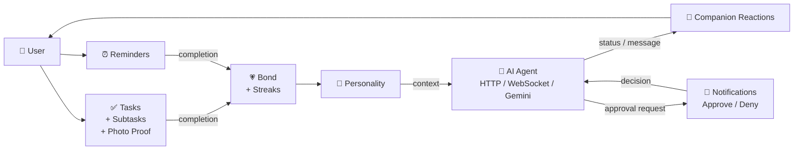

The result is a companion whose state is connected to what you actually do inside the app.

---

# 🌟 Core Features

## 🐾 Digital Companion

PixelPal maintains **one active companion per installation**.

The companion has:

- Name
- Species
- Color
- Pattern
- Bond level
- Streak
- Personality
- Activity history
- Tasks
- Reminders
- AI-agent connection

The current species roster includes:

| Species | Unlock Bond Level |
|---|---:|
| 🐱 Cat | 0 |
| 🐶 Dog | 10 |
| 🐰 Bunny | 25 |
| 🐼 Panda | 30 |
| 🐋 Whale | 40 |
| 🦎 Axolotl | 50 |
| 🦙 Llama | 60 |

Appearance is represented independently through:

**Species × Color × Pattern**

Available appearance options are implemented for species, colors, and patterns rather than treating customization as separate companion identities.

---

## 💗 Bond & Streak System

Bond progression is driven by meaningful interaction.

| Action | Bond effect |
|---|---:|
| Complete task | +2 |
| Complete reminder | +3 |
| Tap interaction | +1, limited meaningful taps/day |
| Feed / play | Cosmetic interaction |
| Daily interaction | Maintains streak |

Bond levels are capped at **100**.

Bond milestones are recorded every **5 levels**, while streak milestones include:

**3 → 7 → 14 → 30 → 60 → 100 days**

The progression system is implemented centrally through `BondEngine`, so different parts of the application do not create their own conflicting bond logic.

---

# ✅ Tasks

PixelPal's task system supports:

- Tasks
- Subtasks
- Task progress
- Completion state
- Ordering
- Photo proof
- Activity events
- Bond progression
- Widget interaction

The flow is:

```text
Tasks
   ↓
New Task
   ↓
Task Details
   ├── Subtasks
   ├── Progress
   └── Photo Proof
   ↓
Complete
   ↓
Bond + Activity Event
```

Task data is stored locally first and can be synchronized with Firestore.

---

# ⏰ Reminders

Reminders use Android scheduling infrastructure rather than relying only on an in-app timer.

Implemented pieces include:

- `AlarmManager`
- `ReminderScheduler`
- `AlarmReceiver`
- `ReminderActionReceiver`
- `BootReceiver`
- Snooze/action handling
- Reminder status tracking
- Bond updates after completion

Reminder state follows the application's persisted lifecycle rather than disappearing after the notification is shown.

---

# 🤖 AI Agent Integration

One of PixelPal's main differentiating features is its **pluggable AI-agent connection layer**.

PixelPal supports multiple agent connection styles:

### HTTP

A generic HTTP endpoint can provide agent state such as:

```json
{
  "status": "WORKING",
  "currentTask": "Run the test suite",
  "progress": 72,
  "message": "Almost done",
  "pendingApproval": false
}
```

### WebSocket

The WebSocket connector supports live event/status delivery using OkHttp.

This enables the application to react to changing agent state without depending only on periodic polling.

### Gemini

PixelPal also contains a Gemini-based connector for AI interaction and streaming responses.

### Agent state

The UI can represent states such as:

```text
CONNECTED
ONLINE
WORKING
IDLE
ERROR
OFFLINE
```

---

# 🔐 Agent Approval Flow

PixelPal can require the user to explicitly approve an agent action.

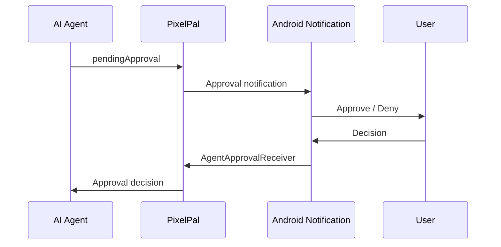

Approval requests are deduplicated using the stored approval identifier so the same request does not repeatedly generate notifications.

---

# 📷 QR Agent Pairing

PixelPal includes CameraX + ML Kit barcode scanning for QR-based agent pairing.

The intended flow is:

```text
Agent Dashboard
      ↓
Generate QR
      ↓
PixelPal Camera
      ↓
Scan QR
      ↓
Store Agent Connection
      ↓
Check / Poll / Stream Agent
```

This is particularly useful for connecting PixelPal to an agent running on the same local network.

---

# 🧠 Personality System

Personality is not simply a static label.

The application contains a personality engine and worker that use interaction information to recalculate the companion's personality state.

The daily personality workflow is handled through `PersonalityWorker`.

Conceptually:

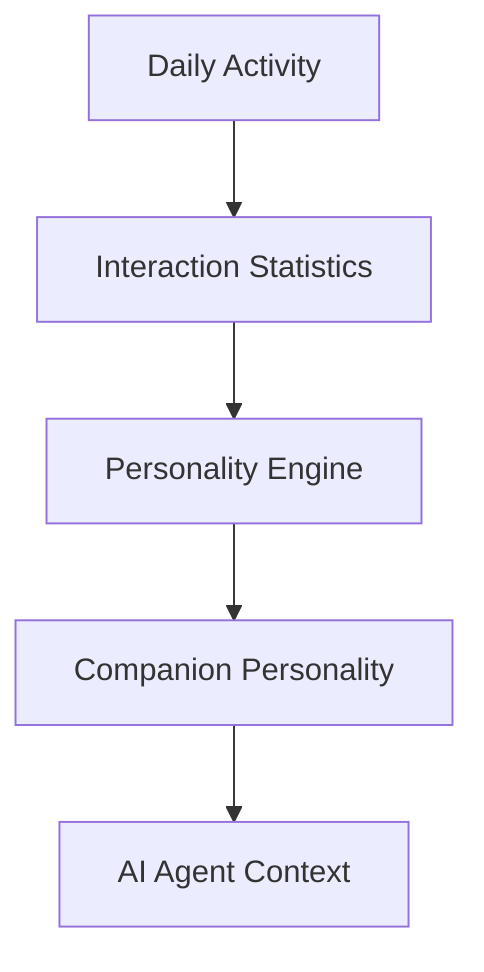

This allows the companion and connected agent to use the same underlying user activity instead of maintaining unrelated personality state.

---

# 🪟 Floating Companion Overlay

PixelPal can display the companion outside the main application through an Android overlay.

The implementation uses:

- `SYSTEM_ALERT_WINDOW`
- Foreground service
- `OverlayService`
- `OverlayManager`
- `OverlaySession`
- Companion rendering
- Speech-bubble UI
- Touch handling
- Dynamic island-style overlay components

The project deliberately limits the active overlay system to **one companion session**.

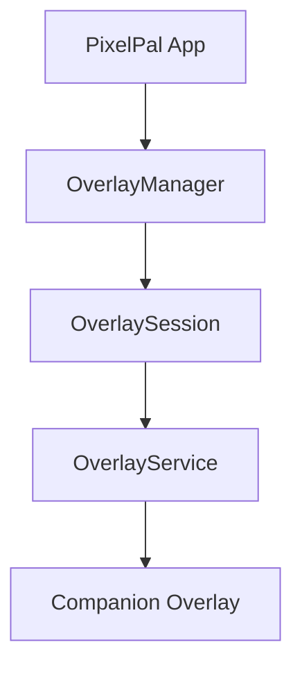

---

# 📱 Home-Screen Widgets

PixelPal contains two Android widgets.

### 🏠 Home Widget

The home widget can display:

- Companion name
- Bond level
- Streak
- Remaining tasks
- Reminder information
- Agent status

### ✅ Tasks Widget

The task widget can:

- Display current tasks
- Show completion state
- Toggle task completion
- Display remaining task count
- Open PixelPal
- Update the home widget after changes

Both widgets read from the same local Room database used by the application.

---

# ☁️ Firebase & Offline-First Data

PixelPal uses Firebase for authentication and cloud synchronization.

### Authentication

The application supports Firebase authentication flows including:

- Anonymous/guest authentication
- Email/password authentication
- Password reset
- Google sign-in integration through Android Credential Manager

### Firestore

The synchronization layer maintains cloud representations of application data, including:

```text
users/
 └── {userId}/
      ├── companion/
      │    └── primary
      ├── tasks/
      ├── reminders/
      └── metrics/
           └── bond
```

The local Room database remains the primary application data layer, while Firestore provides cloud synchronization and real-time updates.

Background synchronization is handled through WorkManager-based workers.

---

# 🏗️ Architecture

PixelPal follows a layered Android architecture built around **Compose UI + ViewModels + domain logic + repositories + Room/Firebase**.

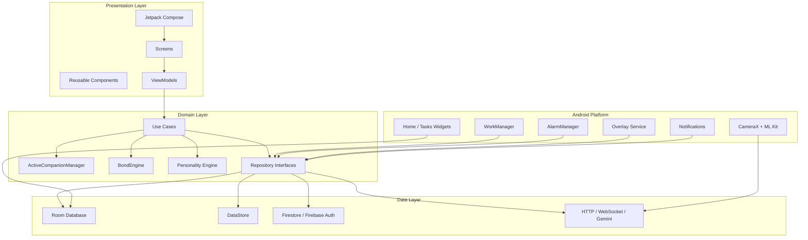

---

# 🗂️ Project Structure

```text
Pixel-Pal/
│
├── app/
│   ├── src/main/
│   │   ├── java/com/pixelpal/app/
│   │   │
│   │   ├── data/
│   │   │   ├── local/
│   │   │   │   ├── db/
│   │   │   │   └── datastore/
│   │   │   ├── remote/
│   │   │   │   ├── firebase/
│   │   │   │   ├── GeminiAgentConnector.kt
│   │   │   │   ├── GenericHttpAgentConnector.kt
│   │   │   │   └── WebSocketAgentConnector.kt
│   │   │   └── repository/
│   │   │
│   │   ├── domain/
│   │   │   ├── engine/
│   │   │   ├── model/
│   │   │   ├── repository/
│   │   │   └── usecase/
│   │   │
│   │   ├── presentation/
│   │   │   ├── components/
│   │   │   ├── screens/
│   │   │   ├── navigation/
│   │   │   └── theme/
│   │   │
│   │   ├── overlay/
│   │   ├── receiver/
│   │   ├── service/
│   │   ├── widget/
│   │   ├── worker/
│   │   └── di/
│   │
│   ├── src/test/
│   └── src/androidTest/
│
├── agent-endpoint/
│   ├── server.py
│   ├── mini_pet.py
│   └── status.json
│
├── docs/
│   └── superpowers/
│
├── .github/
│   └── workflows/
│       └── ci.yml
│
├── gradle/
│   └── libs.versions.toml
│
├── firestore.rules
├── implementation_plan.md
├── AGENTS.md
└── README.md
```

---

# 🛠️ Tech Stack

| Area | Technology |
|---|---|
| Language | Kotlin 2.0.0 |
| Android Build | Android Gradle Plugin 8.5.0 |
| JVM | Java 17 |
| UI | Jetpack Compose |
| Design System | Material 3 |
| Navigation | Navigation Compose |
| Dependency Injection | Hilt |
| Local Database | Room |
| Preferences | DataStore |
| Async | Kotlin Coroutines + Flow |
| Background Work | WorkManager |
| Scheduling | AlarmManager |
| Animation | Lottie |
| Image Loading | Coil |
| Authentication | Firebase Auth + Credential Manager |
| Cloud Database | Cloud Firestore |
| AI | Gemini |
| Agent Networking | OkHttp + HTTP + WebSocket |
| QR Pairing | CameraX + ML Kit |
| Logging | Timber |
| Serialization | Kotlinx Serialization |
| Testing | JUnit + AndroidX Test + Espresso + Compose UI Test |
| CI | GitHub Actions |
| Desktop Companion | Python + PyWebView |

---

# 🔄 Data Flow

The central data flow looks like this:

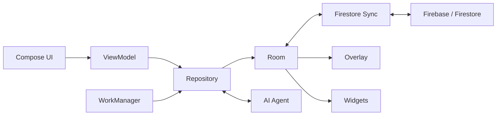

This keeps the application's core state centralized instead of allowing the overlay, widgets, screens, and background workers to maintain independent versions of the companion.

---

# 🎨 Animation System

PixelPal uses Lottie animation assets stored under:

```text
app/src/main/res/raw/
```

Animation states include combinations such as:

```text
idle
blink
happy
sad
excited
thinking
eat
sleep
walk
jump
wave
celebrate
```

The renderer selects animations according to the companion's species and current state, with drawable fallbacks where required.

The repository contains animation assets for the supported companion species.

---

# 🖥️ Desktop Companion Endpoint

The repository also contains a small Python-based companion endpoint:

```text
agent-endpoint/
├── server.py
├── mini_pet.py
└── status.json
```

The endpoint can provide a lightweight agent status surface and a small desktop companion view.

The Android application can use the same agent concept through its HTTP/WebSocket connection layer.

---

# 🧪 Testing

The repository contains both local unit tests and Android instrumented tests.

## Unit tests

Examples include:

- Bond engine behavior
- Personality engine
- Agent connection logic
- Firebase model serialization
- Approval envelope behavior
- Species/model behavior
- Animation state behavior
- Theme/color behavior

## Instrumented tests

The project includes Android tests for:

- Room DAO behavior
- Reminder DAO behavior
- Database migrations
- Navigation smoke testing

Run unit tests locally:

```bash
./gradlew :app:testDebugUnitTest
```

Run instrumented tests on a connected/emulated device:

```bash
./gradlew :app:connectedDebugAndroidTest
```

The instrumented suite depends on a correctly configured Android emulator and ADB environment.

---

# ⚙️ GitHub Actions CI

The repository contains:

```text
.github/workflows/ci.yml
```

The CI pipeline is organized into three jobs:

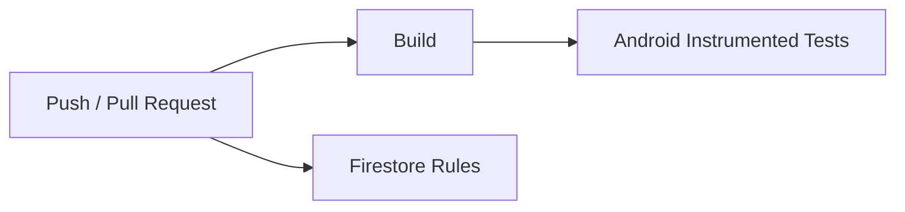

### Build job

The build workflow runs:

```bash
./gradlew :app:assembleDebug
./gradlew :app:testDebugUnitTest
./gradlew :app:lintDebug
```

It also checks that Room schemas remain synchronized.

### Instrumented job

The workflow creates an Android emulator and runs:

```bash
./gradlew :app:connectedDebugAndroidTest
```

The instrumented-test job is intended to validate the application on an Android emulator.

> **CI status note:** The instrumented-test environment may require further emulator/runner configuration depending on the GitHub Actions runner environment. A successful application build does not by itself guarantee that the emulator-based instrumented tests will pass.

### Firestore rules

The workflow also contains a conditional Firestore-rules deployment step when the required Firebase token is available.

---

# 🚀 Getting Started

## Requirements

Before building PixelPal, install:

- Android Studio
- JDK 17
- Android SDK 35
- Git

The project uses:

```text
compileSdk = 35
targetSdk  = 35
minSdk     = 26
```

---

## 1. Clone the repository

```bash
git clone https://github.com/riddhibantia/Pixel-Pal-.git
cd Pixel-Pal-
```

---

## 2. Configure Firebase

The application uses Firebase Authentication and Cloud Firestore.

For your own Firebase project:

1. Create a Firebase project.
2. Add an Android application with package:

```text
com.pixelpal.app
```

3. Download `google-services.json`.
4. Place it in:

```text
app/google-services.json
```

5. Enable the authentication providers you want to use.
6. Create/configure Cloud Firestore.
7. Apply the repository's `firestore.rules`.

> **Security:** Do not commit private API keys, service-account credentials, release keystores, or other secrets.

---

## 3. Configure Gemini

Create a local properties file:

```text
GEMINI_API_KEY=your_api_key_here
```

PixelPal reads the key from `local.properties`, Gradle properties, or the environment.

For CI, the workflow currently supplies a dummy value so the project can compile without exposing a real Gemini key.

---

## 4. Build

```bash
./gradlew :app:assembleDebug
```

On Windows:

```powershell
gradlew.bat :app:assembleDebug
```

---

## 5. Install on a device

```bash
./gradlew :app:installDebug
```

---

# 🔐 Permissions

Depending on the features you use, PixelPal can request Android permissions for:

- Notifications
- Camera
- Overlay display
- Exact alarms
- Boot completed events
- Foreground service
- Accessibility service
- Battery optimization handling

Some features require additional user approval in Android Settings.

PixelPal does not assume these permissions are automatically available.

---

# 📸 Screenshots — Real device (motorola edge 60 stylus)

> Main focus is the **AI Agent** — the primary feature. All shots are from a connected debugger device, not an emulator.

### 🤖 AI Agent Connection (main)

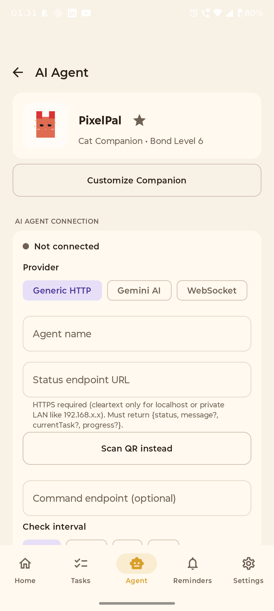

*Generic HTTP / WebSocket / Gemini, endpoint, QR Scan, polling interval — the core of PixelPal.*

### 🏠 Home

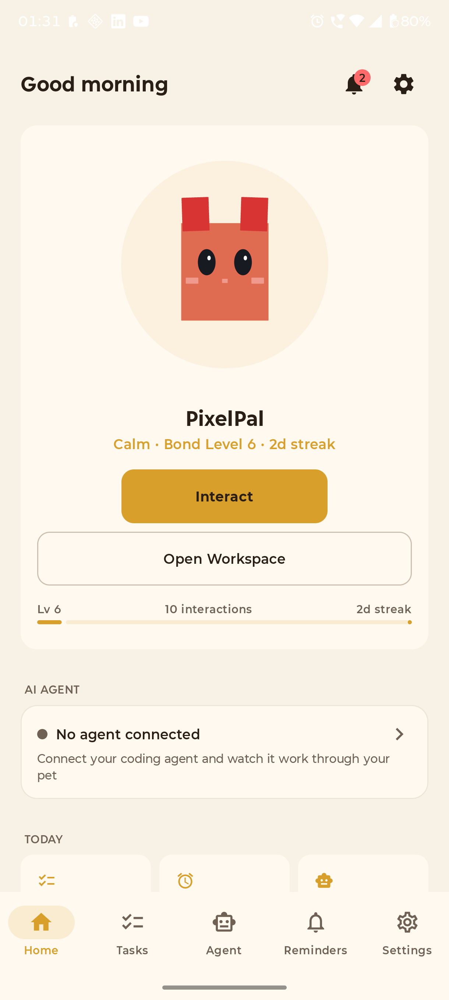

*Square pixel cat hero, bond/streak, AI Agent card and Today chips. Single companion, enforced.*

### ✅ Tasks

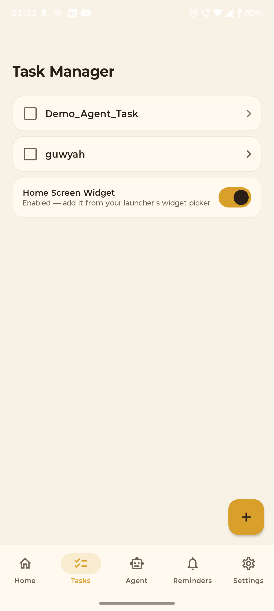

*Tasks with subtasks, progress, swipe-to-delete — feeds Bond +2 and the agent context.*

### ➕ New Task — with subtasks


*Title + description + any number of subtasks → Create Task (photo proof on detail).*

### 🎨 Customize Companion

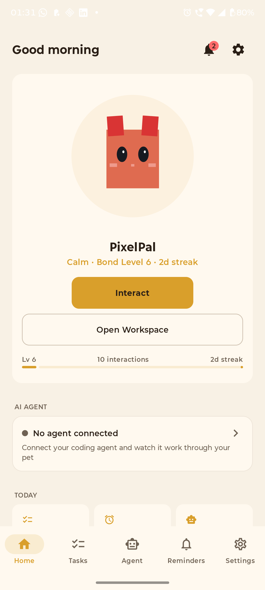

*Species × Color × Pattern — square cat icon is sampled pixel-for-pixel from the Lottie frame.*

---

# 🔒 Security & Privacy

PixelPal connects to external services only for features that require them, such as Firebase synchronization or an explicitly configured AI agent.

Important security considerations:

- Keep `GEMINI_API_KEY` outside source control.
- Use your own Firebase project when deploying your own instance.
- Do not commit Firebase service-account credentials.
- Agent endpoints should be treated as trusted endpoints.
- Approval-gated agent actions require explicit user interaction.
- Private/local HTTP endpoints are supported for development scenarios.

---

# 🧩 Design Principles

PixelPal is built around several architectural principles.

### 1. One companion

There is one active companion.

Tasks, reminders, bond, personality, agent connection, activity, widgets, and overlay behavior all refer back to that companion.

### 2. Local-first state

Room is the application's central local persistence layer.

Cloud synchronization should not require every interaction to depend on a network connection.

### 3. Centralized domain logic

Important rules such as bond progression belong in domain engines rather than individual screens.

### 4. Background work belongs in WorkManager

Periodic work such as agent status checks and personality recalculation is separated from UI lifecycle.

### 5. UI observes state

Compose screens use ViewModels and observable state rather than maintaining their own persistent versions of application data.

---

# 🗺️ Roadmap

Potential future directions include:

- More companion animation packs
- More companion customization
- Richer AI-agent actions
- More real-time agent events
- Expanded activity insights
- More widget sizes and layouts
- Improved desktop companion integration
- Release/distribution automation
- Additional accessibility improvements
- More automated UI and emulator coverage

---

# 📁 Important Project Files

| File / Directory | Purpose |
|---|---|
| `app/src/main/java/com/pixelpal/app/` | Main Android application |
| `data/local/db/` | Room database, entities, DAOs, migrations |
| `data/remote/firebase/` | Firebase authentication and Firestore synchronization |
| `data/remote/` | AI-agent connectors |
| `domain/engine/` | Companion, bond, personality and reaction logic |
| `presentation/` | Compose screens and UI components |
| `overlay/` | Floating companion implementation |
| `worker/` | Background WorkManager jobs |
| `widget/` | Android home-screen widgets |
| `receiver/` | Alarm, boot, approval and screen-state receivers |
| `agent-endpoint/` | Python agent/desktop companion endpoint |
| `.github/workflows/ci.yml` | GitHub Actions CI |
| `firestore.rules` | Firestore security rules |
| `implementation_plan.md` | Project implementation planning |
| `AGENTS.md` | Project architecture and development guidance |

---

# 👩‍💻 Author

**Riddhi Bantia**

Built as an Android project combining:

**Kotlin + Jetpack Compose + Room + Firebase + AI Agents + Lottie**

---

# 📄 License

Add the project's intended license here before publishing a release.

If this repository is intended for public reuse, adding an explicit license is recommended so other developers know what they are allowed to do with the code.

---

<p align="center">

**🐾 PixelPal**

*Do something. Grow together.*

</p>
