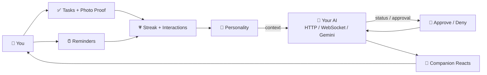

# 🐾 PixelPal — Your AI Companion for Daily Life

[](https://github.com/riddhibantia/Pixel-Pal-/actions)
[](https://kotlinlang.org)
[](https://developer.android.com/jetpack/compose)
[](LICENSE)

> **One pixel pet that lives with you. Your tasks keep it alive — your AI talks through it.**

PixelPal is an Android app (Kotlin + Jetpack Compose) built around **one companion, forever**. Tasks, reminders, streaks, personality, overlay, widgets and AI are not separate screens — they are the same pet's life.

<p align="center">
  
  &nbsp;
  
</p>

<p align="center">
  <a href="https://github.com/riddhibantia/Pixel-Pal-/releases">📲 APK</a> •
  <a href="#-screenshots">Screenshots</a> •
  <a href="#-quick-start">Quick Start</a>
</p>

---

## How it works

**Do → Bond → React.** Every meaningful action grows the companion, and that state is the context your AI sees.



The pet doesn't decorate the todo list — **the todo list feeds the pet that your AI talks through.**

---

## What you can do

- 🤖 **Connect any AI** — paste `https://` / `ws://` / Gemini key. QR-pair via CameraX + ML Kit (private LAN `http` allowed). Polls `{status, currentTask, progress, message, pendingApproval}`, streams live typing to Activity.
- 🔔 **Approve what it does** — one notification per `approvalId`, deduped. Approve/Deny → `POST /approve`.
- ✅ **Tasks that matter** — tasks + subtasks + progress + swipe-to-delete. Detail has **photo proof** (Coil, local-first).
- ⏰ **Reminders that fire** — `AlarmManager` exact, `BootReceiver`, snooze. Completing keeps the streak.
- 💗 **Progress without gates** — all 7 species (Cat, Dog, Bunny, Panda, Whale, Axolotl, Llama) **unlocked from day one**. Streaks (3/7/14/30/60/100) and total interactions are kept — no level locks.
- 🪟 **Overlay & widgets** — floating `SYSTEM_ALERT_WINDOW` (one session), Home + Tasks widgets reading the same Room DB.
- ☁️ **Offline-first** — Room v13 is truth, Firestore syncs with stable `cloudId` + `FirestorePushWorker` retry. Works on the metro.

---

## Tech

| Layer | Stack |
|---|---|
| App | Kotlin 2.0, AGP 8.5, Java 17, Compose + Material3 + Navigation, Lottie |
| Data | Room v13 (8 entities), DataStore, WorkManager, AlarmManager |
| Cloud | Firebase Auth (anon + email), Firestore (offline cache) |
| AI | Gemini `Flow<String>`, OkHttp HTTP + WebSocket, QR (CameraX + ML Kit) |
| Desktop | Python `server.py` / `mini_pet.py` (104×112 PyWebView) |

**Single companion, enforced:** `ActiveCompanionManager.activeCompanion == getPrimary()`. `CompanionBootstrapInitializer` folds legacy rows once. Streak/interactions stay, no hidden bond gates.

---

## Screenshots — real device (motorola edge 60 stylus)

> If you see broken images, hard-refresh. Paths are `docs/screenshots/*.png` relative to this README.

| | | |
|---|---|---|
| **AI Agent** — the main feature | **Home** — hero + streak | **Tasks** |
|  |  |  |
| **New Task** | **Customize** — all unlocked | |
|  |  | |

---

## Quick start

```bash
git clone https://github.com/riddhibantia/Pixel-Pal-.git
cd Pixel-Pal-
# 1. Firebase: add app/google-services.json (package com.pixelpal.app)
# 2. Gemini (optional): echo "GEMINI_API_KEY=..." > local.properties
./gradlew :app:assembleDebug
./gradlew :app:installDebug   # device or emulator, minSdk 26
```

Tests & CI:
```bash
./gradlew :app:testDebugUnitTest
./gradlew :app:connectedDebugAndroidTest
./gradlew :app:lintDebug
# CI: build ✅ / instrumented ✅ (api 35 pixel_7_pro + KVM) / rules ✅
```

Desktop widget:
```bash
python agent-endpoint/server.py 8765
pythonw agent-endpoint/mini_pet.py cat
```

---

## Resume

**PixelPal — AI Companion (Kotlin, Compose, Firebase)** — Single-companion OS (Room v13, offline-first `cloudId` + retry), pluggable agent (HTTP/WS/Gemini, QR LAN, Approve/Deny, live typing), tasks with photo proof + reminders → streaks.

Put in resume: `github.com/riddhibantia/Pixel-Pal-` + one screenshot + one line above. Pair with a 30s screen-record for the best response rate.

---

## License

MIT — see [LICENSE](LICENSE). Copyright © 2026 Riddhi Bantia. Use your own `google-services.json` and `GEMINI_API_KEY` when forking.
