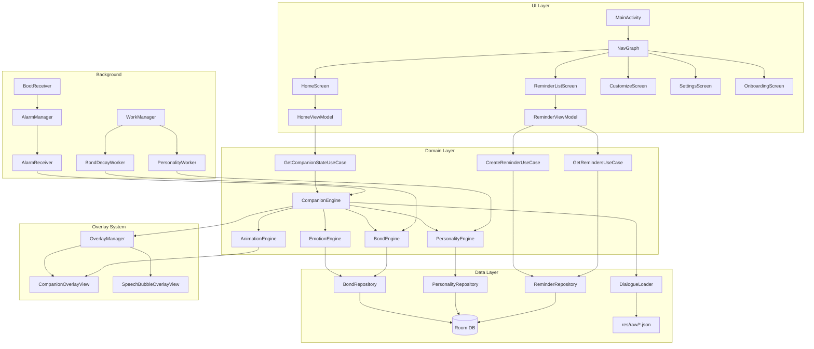

# PixelPal — Detailed Implementation Plan (v3)

---

## Current Project State Audit

The project skeleton already exists at `c:\Users\Nikki\Desktop\Pixel Pet`. Here's exactly what's built vs. what's a stub:

### ✅ Built & Working
| File | Status | Notes |
|---|---|---|
| [build.gradle.kts](file:///c:/Users/Nikki/Desktop/Pixel%20Pet/build.gradle.kts) (root) | ✅ Complete | AGP 8.5.0, Kotlin 2.0.0, Hilt 2.51.1 |
| [app/build.gradle.kts](file:///c:/Users/Nikki/Desktop/Pixel%20Pet/app/build.gradle.kts) | ✅ Complete | Min SDK 26, Target 35, all deps declared |
| [versions.toml](file:///c:/Users/Nikki/Desktop/Pixel%20Pet/gradle/libs/versions.toml) | ✅ Complete | 84 lines, all versions pinned |
| [settings.gradle.kts](file:///c:/Users/Nikki/Desktop/Pixel%20Pet/settings.gradle.kts) | ✅ Complete | Single `:app` module |
| [AndroidManifest.xml](file:///c:/Users/Nikki/Desktop/Pixel%20Pet/app/src/main/AndroidManifest.xml) | ✅ Complete | All permissions, service + receivers declared |
| [PixelPalApplication.kt](file:///c:/Users/Nikki/Desktop/Pixel%20Pet/app/src/main/java/com/pixelpal/app/PixelPalApplication.kt) | ✅ Complete | `@HiltAndroidApp`, Timber planted |
| [MainActivity.kt](file:///c:/Users/Nikki/Desktop/Pixel%20Pet/app/src/main/java/com/pixelpal/app/presentation/MainActivity.kt) | ⚠️ Shell | `@AndroidEntryPoint`, empty Surface — no nav |
| [Constants.kt](file:///c:/Users/Nikki/Desktop/Pixel%20Pet/app/src/main/java/com/pixelpal/app/util/Constants.kt) | ✅ Complete | All keys, channels, defaults defined |
| [AppModule.kt](file:///c:/Users/Nikki/Desktop/Pixel%20Pet/app/src/main/java/com/pixelpal/app/di/AppModule.kt) | ✅ Complete | Provides DataStore |
| [DatabaseModule.kt](file:///c:/Users/Nikki/Desktop/Pixel%20Pet/app/src/main/java/com/pixelpal/app/di/DatabaseModule.kt) | ⚠️ Partial | Provides DB but no DAO providers |
| [ServiceModule.kt](file:///c:/Users/Nikki/Desktop/Pixel%20Pet/app/src/main/java/com/pixelpal/app/di/ServiceModule.kt) | ⚠️ Stub | Empty object, placeholder comment |
| [Theme.kt](file:///c:/Users/Nikki/Desktop/Pixel%20Pet/app/src/main/java/com/pixelpal/app/presentation/theme/Theme.kt) | ✅ Complete | Dark + Light schemes |
| [Color.kt](file:///c:/Users/Nikki/Desktop/Pixel%20Pet/app/src/main/java/com/pixelpal/app/presentation/theme/Color.kt) | ✅ Complete | Pixel-art palette, dark + light |
| [Shape.kt](file:///c:/Users/Nikki/Desktop/Pixel%20Pet/app/src/main/java/com/pixelpal/app/presentation/theme/Shape.kt) | ✅ Complete | Material3 shapes |
| [Type.kt](file:///c:/Users/Nikki/Desktop/Pixel%20Pet/app/src/main/java/com/pixelpal/app/presentation/theme/Type.kt) | ✅ Complete | Custom typography |
| [PixelPalDatabase.kt](file:///c:/Users/Nikki/Desktop/Pixel%20Pet/app/src/main/java/com/pixelpal/app/data/local/db/PixelPalDatabase.kt) | 🔴 Broken | `entities = []` — Room won't compile |
| Domain models (6 files) | ✅ Complete | Reminder, Bond, Personality, Companion, Emotion, PetType |

### 🔴 Known Build Blockers
1. **`data_extraction_rules.xml`** — Referenced in Manifest (`android:dataExtractionRules`) but missing from `res/xml/`
2. **`Room entities = []`** — Empty entity list means Room won't compile
3. **`OverlayService.kt`** — Declared in Manifest but no Kotlin source file
4. **`AlarmReceiver.kt`** — Declared in Manifest but no Kotlin source file
5. **`BootReceiver.kt`** — Declared in Manifest but no Kotlin source file
6. **`hilt-navigation-compose` version** — Uses Hilt version `2.51.1` but should be `1.2.0` (different artifact group)
7. **Duplicate `namespace`** — `app/build.gradle.kts` declares `namespace` twice (lines 10 and 60)
8. **`kotlinx-serialization-json` version** — Uses Kotlin version `2.0.0` but should be `1.7.1` or similar

### 📁 Empty Directories (Stubs Awaiting Implementation)
```
data/local/db/dao/          ← No DAO files
data/local/db/entity/       ← No entity files  
data/local/datastore/       ← No PreferencesManager
data/dialogue/              ← No DialogueLoader
data/repository/            ← No repository implementations
domain/engine/              ← No engine files
domain/repository/          ← No repository interfaces
domain/usecase/companion/   ← No use case files
domain/usecase/personality/ ← No use case files
domain/usecase/reminder/    ← No use case files
presentation/components/    ← No composables
presentation/navigation/    ← No NavGraph
presentation/screens/home/  ← No HomeScreen
presentation/screens/reminders/
presentation/screens/companion/
presentation/screens/customize/
presentation/screens/settings/
presentation/screens/onboarding/
overlay/                    ← No overlay service
animation/                  ← No animation engine
worker/                     ← No workers
receiver/                   ← No receivers
```

---

## Decisions Locked

| Decision | Answer |
|---|---|
| Min SDK | API 26 (Android 8.0) |
| Pet naming | User names pet during onboarding, used everywhere |
| App display name | "PixelPal" on Play Store & app drawer |
| Pet name usage | In dialogue, notifications, home screen |
| Pixel art | AI-generated concepts → static PNGs Phase 1 → animated WebP Phase 3 |
| Dialogue | 200+ lines, structured JSON, written in Phase 2 |
| Monetization | Free (no IAP, no ads) |
| Sound | None for v1 |
| Image loading | Coil (for animated WebP across API 26+) |
| Exact reminders | AlarmManager (not WorkManager) |
| Background tasks | WorkManager (personality recalc, bond decay) |

---

## Architecture Deep Dive

### Data Flow Diagram



### Dependency Graph (What Depends on What)

```
CompanionEngine (central brain)
├── EmotionEngine       ← needs BondEngine (emotion duration varies by bond)
├── BondEngine          ← needs ReminderRepository (completion tracking)
├── PersonalityEngine   ← needs BondEngine (personality influenced by interactions)
├── AnimationEngine     ← needs EmotionEngine (emotion → animation mapping)
├── DialogueLoader      ← needs EmotionEngine, BondEngine, PersonalityEngine
└── OverlayManager      ← needs AnimationEngine, DialogueLoader

OverlayService
├── CompanionEngine     ← injected via Hilt
├── OverlayManager      ← manages WindowManager views
├── OverlayTouchHandler ← routes touch events to CompanionEngine
└── PreferencesManager  ← overlay position persistence

ReminderScheduler
├── AlarmManager        ← system service
├── ReminderRepository  ← reads pending reminders
└── Context             ← for PendingIntent creation
```

---

## Phase 1 — Foundation (Weeks 1–3)

> **Goal:** Fix build blockers, create the overlay service, get a floating pixel companion on screen that animates and responds to taps. User names their pet during onboarding.

---

### Week 1: Fix Build & Create Overlay Service

#### Step 1.1 — Fix Build Blockers

##### [NEW] `res/xml/data_extraction_rules.xml`
```xml
<?xml version="1.0" encoding="utf-8"?>
<data-extraction-rules>
    <cloud-backup>
        <include domain="database" path="pixelpal_database"/>
        <include domain="sharedpref" path="pixelpal_preferences.preferences_pb"/>
    </cloud-backup>
    <device-transfer>
        <include domain="database" path="pixelpal_database"/>
        <include domain="sharedpref" path="pixelpal_preferences.preferences_pb"/>
    </device-transfer>
</data-extraction-rules>
```

##### [MODIFY] `app/build.gradle.kts`
- Remove duplicate `namespace` (line 60)
- Fix `hilt-navigation-compose` version → `1.2.0`
- Fix `kotlinx-serialization-json` version → `1.7.1`
- Change `packagingOptions` → `packaging` (deprecated API)
- Remove `composeOptions` block (use Compose compiler plugin instead)

##### [MODIFY] `versions.toml`
- Add `hiltNavigationCompose = "1.2.0"`
- Fix `kotlinx-serialization-json` to use proper version `1.7.1`
- Add separate entry for `hilt-navigation-compose` with correct version

##### [MODIFY] `PixelPalDatabase.kt`
- Add placeholder entity to unblock compilation (will be replaced in Phase 2 with real entities)
- OR: Defer Room setup entirely to Phase 2 and comment out Room-related code

**Decision: Defer Room to Phase 2.** Remove Room dependency temporarily from `DatabaseModule` and comment out database-related Hilt providers. This lets us focus on the overlay service first.

---

#### Step 1.2 — DataStore PreferencesManager

##### [NEW] `data/local/datastore/PreferencesManager.kt`
Purpose: Type-safe wrapper around DataStore for all app preferences.

```kotlin
@Singleton
class PreferencesManager @Inject constructor(
    private val dataStore: DataStore<Preferences>
) {
    // Preference keys
    private object Keys {
        val OVERLAY_X = floatPreferencesKey(Constants.KEY_OVERLAY_X)
        val OVERLAY_Y = floatPreferencesKey(Constants.KEY_OVERLAY_Y)
        val OVERLAY_ENABLED = booleanPreferencesKey(Constants.KEY_OVERLAY_ENABLED)
        val PET_NAME = stringPreferencesKey(Constants.KEY_PET_NAME)
        val USER_NAME = stringPreferencesKey(Constants.KEY_USER_NAME)
        val SELECTED_PET_TYPE = stringPreferencesKey(Constants.KEY_SELECTED_PET_TYPE)
        val IS_FIRST_LAUNCH = booleanPreferencesKey(Constants.KEY_IS_FIRST_LAUNCH)
        val CURRENT_THEME = stringPreferencesKey(Constants.KEY_CURRENT_THEME)
    }

    // Read methods — all return Flow<T>
    val overlayPosition: Flow<Pair<Float, Float>>
    val overlayEnabled: Flow<Boolean>
    val petName: Flow<String>
    val userName: Flow<String>
    val selectedPetType: Flow<String>
    val isFirstLaunch: Flow<Boolean>
    val currentTheme: Flow<String>

    // Write methods — all suspend functions
    suspend fun updateOverlayPosition(x: Float, y: Float)
    suspend fun setOverlayEnabled(enabled: Boolean)
    suspend fun setPetName(name: String)
    suspend fun setUserName(name: String)
    suspend fun setSelectedPetType(type: String)
    suspend fun setIsFirstLaunch(isFirst: Boolean)
    suspend fun setCurrentTheme(theme: String)
}
```

---

#### Step 1.3 — Overlay Service (MOST CRITICAL)

This is the heart of PixelPal. Five files work together:

##### [NEW] `overlay/OverlayService.kt`
Purpose: Foreground service that keeps the overlay alive.

```kotlin
@AndroidEntryPoint
class OverlayService : Service() {

    @Inject lateinit var overlayManager: OverlayManager
    @Inject lateinit var preferencesManager: PreferencesManager

    // Lifecycle
    override fun onCreate()
        → createNotificationChannel()
        → startForeground(FOREGROUND_SERVICE_ID, buildNotification())
        → overlayManager.showCompanion()

    override fun onStartCommand(intent, flags, startId): Int
        → return START_STICKY  // Auto-restart if killed

    override fun onDestroy()
        → overlayManager.hideCompanion()

    override fun onBind(intent): IBinder? = null

    // Notification
    private fun createNotificationChannel()
        → NotificationChannel(CHANNEL_COMPANION, "Companion", IMPORTANCE_LOW)
        → No sound, no vibration, minimal presence

    private fun buildNotification(): Notification
        → SmallIcon: pixel pet icon
        → Title: "{petName} is hanging out with you 🐱"
        → ContentIntent: opens MainActivity
        → Ongoing: true, silent: true

    // Companion actions
    companion object {
        fun start(context: Context)
        fun stop(context: Context)
        fun isRunning(): Boolean
    }
}
```

**Manifest already declares this service:**
```xml
<service
    android:name=".overlay.OverlayService"
    android:exported="false"
    android:foregroundServiceType="systemExempted" />
```

##### [NEW] `overlay/OverlayManager.kt`
Purpose: Manages WindowManager — adds/removes/positions the floating views.

```kotlin
@Singleton
class OverlayManager @Inject constructor(
    @ApplicationContext private val context: Context,
    private val preferencesManager: PreferencesManager
) {
    private var windowManager: WindowManager
    private var companionView: CompanionOverlayView? = null
    private var speechBubbleView: SpeechBubbleOverlayView? = null  // Phase 2

    // Window layout params
    private fun createLayoutParams(): WindowManager.LayoutParams
        → TYPE_APPLICATION_OVERLAY
        → FLAG_NOT_FOCUSABLE or FLAG_NOT_TOUCH_MODAL
        → WRAP_CONTENT size
        → PixelFormat.TRANSLUCENT
        → gravity: TOP or START (absolute positioning)

    // Companion view management
    fun showCompanion()
        → Create CompanionOverlayView
        → Restore saved position from DataStore
        → windowManager.addView(companionView, params)

    fun hideCompanion()
        → windowManager.removeView(companionView)
        → companionView = null

    fun updatePosition(x: Int, y: Int)
        → Update layoutParams.x, layoutParams.y
        → windowManager.updateViewLayout(companionView, params)
        → Save to DataStore (debounced)

    // Speech bubble (Phase 2)
    fun showSpeechBubble(text: String, actions: List<BubbleAction>? = null)
    fun hideSpeechBubble()

    val isShowing: Boolean
}
```

##### [NEW] `overlay/CompanionOverlayView.kt`
Purpose: The actual floating view that renders the pet sprite.

```kotlin
class CompanionOverlayView(context: Context) : FrameLayout(context) {

    private val imageView: ImageView  // Renders current sprite
    private val size = (Constants.OVERLAY_SIZE_DP * resources.displayMetrics.density).toInt()

    init {
        → layoutParams = LayoutParams(size, size)
        → imageView configured with Coil loader
        → background = transparent
    }

    fun updateSprite(drawableRes: Int)
        → Load drawable via Coil into imageView
        → CrossfadeTransformation for smooth transitions

    fun updateSprite(animatedWebP: Int)  // Phase 3
        → Load animated WebP via Coil GIF decoder
}
```

##### [NEW] `overlay/OverlayTouchHandler.kt`
Purpose: Handles tap, double-tap, long-press, and drag on the companion view.

```kotlin
class OverlayTouchHandler(
    private val overlayManager: OverlayManager,
    private val onTap: () -> Unit,
    private val onDoubleTap: () -> Unit,         // Phase 2
    private val onLongPress: () -> Unit,          // Phase 2
    private val onDragEnd: (x: Float, y: Float) -> Unit
) : View.OnTouchListener {

    // State tracking
    private var isDragging = false
    private var initialX: Int = 0       // View's initial X
    private var initialY: Int = 0       // View's initial Y
    private var initialTouchX: Float = 0f  // Finger's initial X
    private var initialTouchY: Float = 0f  // Finger's initial Y
    private val tapThreshold = 10  // pixels — below this = tap, above = drag
    private val longPressDelay = 500L  // ms

    override fun onTouch(view: View, event: MotionEvent): Boolean {
        when (event.action) {
            ACTION_DOWN → record initial positions, start long-press timer
            ACTION_MOVE → if moved > tapThreshold, start dragging
                          → overlayManager.updatePosition(newX, newY)
            ACTION_UP   → if !isDragging, fire onTap()
                          → if isDragging, fire onDragEnd(finalX, finalY)
                          → cancel long-press timer
        }
    }
}
```

##### [MODIFY] `di/ServiceModule.kt`
Purpose: Provide overlay-related dependencies.

```kotlin
@Module
@InstallIn(SingletonComponent::class)
object ServiceModule {

    @Provides
    @Singleton
    fun provideOverlayManager(
        @ApplicationContext context: Context,
        preferencesManager: PreferencesManager
    ): OverlayManager = OverlayManager(context, preferencesManager)
}
```

##### [NEW] `util/PermissionHelper.kt`
Purpose: Overlay permission check and request flow.

```kotlin
object PermissionHelper {
    fun canDrawOverlays(context: Context): Boolean
        → Settings.canDrawOverlays(context)

    fun requestOverlayPermission(activity: Activity)
        → Intent(Settings.ACTION_MANAGE_OVERLAY_PERMISSION)
        → uri = "package:${activity.packageName}"

    fun canScheduleExactAlarms(context: Context): Boolean  // API 31+
        → if (SDK >= 31) alarmManager.canScheduleExactAlarms() else true

    fun requestExactAlarmPermission(activity: Activity)  // API 31+
        → Intent(Settings.ACTION_REQUEST_SCHEDULE_EXACT_ALARM)
}
```

---

### Week 2: Animation System

#### Step 2.1 — Animation State Machine

##### [NEW] `animation/AnimationState.kt`
Purpose: Enum of all possible animation states with metadata.

```kotlin
enum class AnimationState(
    val drawableResName: String,  // "pet_cat_idle", etc.
    val durationMs: Long,         // How long this animation plays
    val loops: Boolean,           // Does it loop or play once?
    val nextState: AnimationState? // What state to return to (null = IDLE)
) {
    IDLE("idle", Long.MAX_VALUE, true, null),
    BLINK("blink", 400, false, IDLE),
    WALK("walk", 2000, true, IDLE),
    WAVE("wave", 1500, false, IDLE),
    JUMP("jump", 800, false, IDLE),
    SLEEP("sleep", Long.MAX_VALUE, true, null),  // Stays until interrupted
    EAT("eat", 2000, false, HAPPY),
    HAPPY("happy", 2000, false, IDLE),
    THINKING("thinking", Long.MAX_VALUE, true, null),  // Stays until dismissed
    SAD("sad", 3000, true, IDLE),
    EXCITED("excited", 2500, false, HAPPY),
    CURIOUS("curious", 2000, false, IDLE);

    fun getDrawableResId(petType: String, context: Context): Int {
        val name = "pet_${petType}_${drawableResName}"
        return context.resources.getIdentifier(name, "drawable", context.packageName)
    }
}
```

##### [NEW] `animation/AnimationEngine.kt`
Purpose: Finite state machine that controls which animation is playing.

```kotlin
@Singleton
class AnimationEngine @Inject constructor(
    private val coroutineScope: CoroutineScope
) {
    // Current state observable
    private val _currentState = MutableStateFlow(AnimationState.IDLE)
    val currentState: StateFlow<AnimationState> = _currentState.asStateFlow()

    // Auto-blink timer
    private var blinkJob: Job? = null
    private var sleepJob: Job? = null
    private var returnToIdleJob: Job? = null

    fun initialize() {
        startBlinkTimer()
        startSleepTimer()
    }

    // Triggered transitions (from user interaction / reminders)
    fun trigger(state: AnimationState) {
        cancelReturnJob()
        _currentState.value = state
        if (!state.loops || state.nextState != null) {
            scheduleReturn(state)
        }
    }

    // Auto-blink: every 3–8 seconds while IDLE
    private fun startBlinkTimer() {
        blinkJob = coroutineScope.launch {
            while (isActive) {
                delay(Random.nextLong(3000, 8000))
                if (_currentState.value == AnimationState.IDLE) {
                    trigger(AnimationState.BLINK)
                }
            }
        }
    }

    // Auto-sleep: after 2 minutes of no triggered animation
    private var lastInteractionTime = System.currentTimeMillis()
    private fun startSleepTimer() { /* ... */ }

    // Return to idle after non-looping animation completes
    private fun scheduleReturn(state: AnimationState) {
        returnToIdleJob = coroutineScope.launch {
            delay(state.durationMs)
            _currentState.value = state.nextState ?: AnimationState.IDLE
        }
    }

    fun destroy() {
        blinkJob?.cancel()
        sleepJob?.cancel()
        returnToIdleJob?.cancel()
    }
}
```

##### [NEW] `animation/AnimationConfig.kt`
Purpose: Configuration constants for animation timing.

```kotlin
object AnimationConfig {
    const val BLINK_MIN_INTERVAL_MS = 3000L
    const val BLINK_MAX_INTERVAL_MS = 8000L
    const val SLEEP_TIMEOUT_MS = 120_000L  // 2 minutes
    const val CROSSFADE_DURATION_MS = 100
    const val FRAME_RATE_NORMAL = 8   // FPS for normal animations
    const val FRAME_RATE_FAST = 12    // FPS for excited/jump
}
```

##### [NEW] `animation/SpriteAnimator.kt`
Purpose: Phase 1 — swaps static PNGs. Phase 3 — cycles animated WebP frames.

```kotlin
@Singleton
class SpriteAnimator @Inject constructor(
    @ApplicationContext private val context: Context,
    private val animationEngine: AnimationEngine
) {
    // Observable drawable resource for current frame
    val currentDrawableRes: StateFlow<Int>

    // Pet type determines which sprite sheet to load
    private var currentPetType: String = "cat"

    fun setPetType(petType: String) {
        currentPetType = petType
        refreshDrawable()
    }

    // Observe animation engine state changes → update drawable
    fun startObserving(scope: CoroutineScope) {
        scope.launch {
            animationEngine.currentState.collect { state ->
                val resId = state.getDrawableResId(currentPetType, context)
                _currentDrawableRes.value = resId
            }
        }
    }
}
```

#### Step 2.2 — Pixel Art Assets (Placeholder)

##### [NEW] Static PNG assets for cat pet

I will generate pixel art concept images for each state. For Phase 1, we use one static PNG per animation state:

| Asset File | Animation | Pixel Size |
|---|---|---|
| `res/drawable/pet_cat_idle.png` | Standing, eyes open | 32×32 |
| `res/drawable/pet_cat_blink.png` | Eyes closed | 32×32 |
| `res/drawable/pet_cat_happy.png` | Smiling, ears up | 32×32 |
| `res/drawable/pet_cat_sleep.png` | Eyes closed, Zzz | 32×32 |
| `res/drawable/pet_cat_thinking.png` | Looking up, thought bubble | 32×32 |
| `res/drawable/pet_cat_sad.png` | Droopy ears, frown | 32×32 |
| `res/drawable/pet_cat_excited.png` | Jumping, sparkles | 32×32 |
| `res/drawable/pet_cat_curious.png` | Head tilted | 32×32 |
| `res/drawable/pet_cat_wave.png` | Paw raised | 32×32 |
| `res/drawable/pet_cat_walk.png` | Mid-stride | 32×32 |
| `res/drawable/pet_cat_jump.png` | In the air | 32×32 |
| `res/drawable/pet_cat_eat.png` | Eating from bowl | 32×32 |

Each exported at multiple densities or as a single high-res PNG that Coil scales.

#### Step 2.3 — Connect Animation to Overlay

##### [MODIFY] `overlay/CompanionOverlayView.kt`
- Observe `SpriteAnimator.currentDrawableRes`
- On change → load new drawable via Coil with crossfade

##### [MODIFY] `overlay/OverlayService.kt`
- Inject `AnimationEngine` and `SpriteAnimator`
- `onCreate()` → initialize both
- Wire `OverlayTouchHandler.onTap` → `animationEngine.trigger(HAPPY)`

---

### Week 3: Main App Shell + Onboarding

#### Step 3.1 — Navigation

##### [NEW] `presentation/navigation/NavGraph.kt`
Purpose: Defines all app routes and the navigation host.

```kotlin
// Route definitions
sealed class Screen(val route: String) {
    object Onboarding : Screen("onboarding")
    object Home : Screen("home")
    object Reminders : Screen("reminders")
    object CreateReminder : Screen("create_reminder")
    object Customize : Screen("customize")
    object Settings : Screen("settings")
}

@Composable
fun PixelPalNavGraph(
    navController: NavHostController,
    startDestination: String,  // "onboarding" if first launch, "home" otherwise
    preferencesManager: PreferencesManager
) {
    NavHost(navController, startDestination) {
        composable(Screen.Onboarding.route) { OnboardingScreen(navController) }
        composable(Screen.Home.route) { HomeScreen(navController) }
        composable(Screen.Reminders.route) { ReminderListScreen(navController) }
        composable(Screen.CreateReminder.route) { CreateReminderScreen(navController) }
        composable(Screen.Customize.route) { CustomizeScreen(navController) }
        composable(Screen.Settings.route) { SettingsScreen(navController) }
    }
}
```

##### [MODIFY] `presentation/MainActivity.kt`
- Check `isFirstLaunch` from DataStore
- Set `startDestination` accordingly
- Add bottom navigation bar (Home, Reminders, Customize, Settings)
- Navigation bar icons + labels

#### Step 3.2 — Onboarding

##### [NEW] `presentation/screens/onboarding/OnboardingScreen.kt`
Purpose: 4-page horizontal pager for first-time setup.

```
Page 1: "Welcome to PixelPal"
    → Pixel art logo (large)
    → "Your tiny companion is waiting to meet you."
    → [Next →] button

Page 2: "Choose Your Companion"
    → Cat displayed in center (animated idle)
    → Dog, Bunny, Fox, Axolotl shown as dark silhouettes with lock icons
    → "More friends coming soon!"
    → [Choose Cat] button (only selectable option)

Page 3: "Name Your Companion"
    → Cat preview at top (reacts to typing — shows curious/blink animation)
    → Text field: "What will you call your companion?"
    → Placeholder hint: "Pixel"
    → Character counter: 0/20
    → [Next →] button (disabled until name entered, min 1 char)
    → Saves petName to DataStore

Page 4: "Let {petName} Join You!"
    → "{petName} wants to hang out on your screen!"
    → Visual mock-up showing pet on top of a phone screenshot
    → Explanation: "PixelPal will appear as a small floating companion."
    → [Enable] button → calls PermissionHelper.requestOverlayPermission()
    → After return, check canDrawOverlays()
        → If granted: start OverlayService, show "[Let's Go!]" button
        → If denied: show "You can enable this later in Settings"
    → [Let's Go!] → setIsFirstLaunch(false), navigate to Home
```

##### [NEW] `presentation/screens/onboarding/OnboardingViewModel.kt`

```kotlin
@HiltViewModel
class OnboardingViewModel @Inject constructor(
    private val preferencesManager: PreferencesManager
) : ViewModel() {

    val currentPage = MutableStateFlow(0)

    fun selectPetType(type: PetType) { /* save to prefs */ }
    fun setPetName(name: String) { /* save to prefs */ }
    fun completeOnboarding() { /* set isFirstLaunch = false */ }
}
```

#### Step 3.3 — Home Screen

##### [NEW] `presentation/screens/home/HomeScreen.kt`
Purpose: Main screen showing the pet, bond level, emotion, and overlay toggle.

```
Layout:
┌──────────────────────────────────┐
│  PixelPal                        │  ← App bar with app name
├──────────────────────────────────┤
│                                  │
│         ┌──────────┐             │
│         │          │             │
│         │   🐱     │             │  ← Large PetRenderer (200dp)
│         │  {idle}  │             │
│         └──────────┘             │
│         "{petName}"              │  ← Pet name, large text
│         😊 Happy                 │  ← Emotion badge
│                                  │
│  ┌────────────────────────────┐  │
│  │ Bond: ████████░░ 42        │  │  ← Progress bar
│  │ "Good friends"             │  │  ← Bond label
│  └────────────────────────────┘  │
│                                  │
│  📅 Together: 12 days            │  ← Days since first launch
│  👆 Interactions: 156            │  ← Total tap count
│  🔥 Streak: 5 days              │  ← Consecutive days
│                                  │
│  ┌────────────────────────────┐  │
│  │  Show/Hide {petName}  🔘  │  │  ← Overlay toggle
│  └────────────────────────────┘  │
└──────────────────────────────────┘
│ 🏠 Home │ 📋 Remind │ 🎨 Custom │ ⚙️ Set │  ← Bottom nav
```

##### [NEW] `presentation/screens/home/HomeViewModel.kt`

```kotlin
@HiltViewModel
class HomeViewModel @Inject constructor(
    private val preferencesManager: PreferencesManager,
    private val animationEngine: AnimationEngine
    // Phase 2: + bondEngine, emotionEngine
) : ViewModel() {

    val petName: StateFlow<String>
    val selectedPetType: StateFlow<String>
    val overlayEnabled: StateFlow<Boolean>
    val currentAnimation: StateFlow<AnimationState>
    // Phase 2: val bondLevel, val currentEmotion

    fun toggleOverlay(context: Context)
    fun tapPet()  // triggers happy animation
}
```

#### Step 3.4 — Reusable Components

##### [NEW] `presentation/components/PetRenderer.kt`
Purpose: Composable that renders the pet at any size.

```kotlin
@Composable
fun PetRenderer(
    petType: String,
    animationState: AnimationState,
    size: Dp = 200.dp,
    modifier: Modifier = Modifier
) {
    val drawableRes = animationState.getDrawableResId(petType, LocalContext.current)
    AsyncImage(
        model = drawableRes,
        contentDescription = "Your companion",
        modifier = modifier.size(size),
        imageLoader = ImageLoader.Builder(LocalContext.current)
            .components { add(ImageDecoderDecoder.Factory()) }  // For animated WebP
            .build()
    )
}
```

#### Step 3.5 — Placeholder Screens (Phase 2+)

##### [NEW] `presentation/screens/reminders/ReminderListScreen.kt`
- Placeholder: "{petName} has nothing to remind you about yet!"
- Locked preview of what the reminder list will look like
- "Coming in the next update!" message

##### [NEW] `presentation/screens/customize/CustomizeScreen.kt`
- Current pet displayed with name
- Tap to rename pet (opens dialog)
- Pet type grid (only cat unlocked, others silhouetted)
- Accessories: "Coming soon"
- Theme selector: Dark (active), Light (selectable), others locked

##### [NEW] `presentation/screens/settings/SettingsScreen.kt`
- Overlay toggle
- Reset overlay position
- Edit pet name
- Edit user name
- About section (version, credits)
- Debug section (dev builds only): Reset onboarding, Clear data

### Phase 1 Deliverable

> **What the user sees:** After installing, a 4-page onboarding lets them name their cat companion. The cat appears as a 64dp floating overlay in the bottom-right corner. It idles, blinks every 3–8 seconds, falls asleep after 2 minutes of no interaction, and reacts happily when tapped. It can be dragged to any position and remembers its location. The main app shows the pet's name, bond level (placeholder at 0), current animation state, and an overlay toggle.

> **What builds:** `gradlew.bat :app:assembleDebug` compiles without errors. All build blockers resolved.

---

## Phase 2 — Core Companion (Weeks 4–7)

> **Goal:** Reminders work end-to-end. The pet speaks via speech bubbles with 200+ dialogue lines. Bond and emotion systems track state. The CompanionEngine orchestrates everything.

---

### Week 4: Room Database & Reminder CRUD

#### Step 4.1 — Room Entities

##### [NEW] `data/local/db/entity/ReminderEntity.kt`
```kotlin
@Entity(tableName = "reminders")
data class ReminderEntity(
    @PrimaryKey(autoGenerate = true) val id: Long = 0,
    val title: String,
    val message: String? = null,
    val triggerTime: Long,
    val recurrence: String = "ONCE",      // ONCE, DAILY, WEEKLY, MONTHLY
    val recurrenceInterval: Long? = null,
    val category: String = "CUSTOM",      // MEETING, MEDICINE, BIRTHDAY, SHOPPING, ASSIGNMENT, CUSTOM
    val status: String = "PENDING",       // PENDING, TRIGGERED, COMPLETED, SNOOZED, DISMISSED
    val snoozeCount: Int = 0,
    val createdAt: Long = System.currentTimeMillis(),
    val completedAt: Long? = null
)
```

##### [NEW] `data/local/db/entity/BondEntity.kt`
```kotlin
@Entity(tableName = "bond")
data class BondEntity(
    @PrimaryKey val id: Int = 1,  // Singleton
    val level: Int = 0,
    val totalInteractions: Int = 0,
    val tapsToday: Int = 0,
    val feedsToday: Int = 0,
    val lastInteractionTime: Long = 0L,
    val streakDays: Int = 0,
    val lastStreakDate: String = ""
)
```

##### [NEW] `data/local/db/entity/PersonalityEntity.kt`
```kotlin
@Entity(tableName = "personality")
data class PersonalityEntity(
    @PrimaryKey val id: Int = 1,  // Singleton
    val friendliness: Float = 0.5f,
    val curiosity: Float = 0.5f,
    val playfulness: Float = 0.5f,
    val sleepiness: Float = 0.5f,
    val confidence: Float = 0.5f,
    val independence: Float = 0.5f,
    val lastUpdated: Long = System.currentTimeMillis()
)
```

##### [NEW] `data/local/db/entity/CompanionEntity.kt`
```kotlin
@Entity(tableName = "companion")
data class CompanionEntity(
    @PrimaryKey val id: Int = 1,  // Singleton
    val petType: String = "CAT",
    val hatId: String? = null,
    val outfitId: String? = null,
    val accessoryId: String? = null
)
```

#### Step 4.2 — DAOs

##### [NEW] `data/local/db/dao/ReminderDao.kt`
```kotlin
@Dao
interface ReminderDao {
    @Query("SELECT * FROM reminders WHERE status = 'PENDING' ORDER BY triggerTime ASC")
    fun getPendingReminders(): Flow<List<ReminderEntity>>

    @Query("SELECT * FROM reminders WHERE status = 'COMPLETED' ORDER BY completedAt DESC")
    fun getCompletedReminders(): Flow<List<ReminderEntity>>

    @Query("SELECT * FROM reminders ORDER BY triggerTime ASC")
    fun getAllReminders(): Flow<List<ReminderEntity>>

    @Query("SELECT * FROM reminders WHERE id = :id")
    suspend fun getReminderById(id: Long): ReminderEntity?

    @Insert(onConflict = OnConflictStrategy.REPLACE)
    suspend fun insert(reminder: ReminderEntity): Long

    @Update
    suspend fun update(reminder: ReminderEntity)

    @Delete
    suspend fun delete(reminder: ReminderEntity)

    @Query("UPDATE reminders SET status = :status, completedAt = :completedAt WHERE id = :id")
    suspend fun updateStatus(id: Long, status: String, completedAt: Long? = null)

    @Query("UPDATE reminders SET snoozeCount = snoozeCount + 1, triggerTime = :newTriggerTime, status = 'PENDING' WHERE id = :id")
    suspend fun snooze(id: Long, newTriggerTime: Long)
}
```

##### [NEW] `data/local/db/dao/BondDao.kt`
```kotlin
@Dao
interface BondDao {
    @Query("SELECT * FROM bond WHERE id = 1")
    fun getBond(): Flow<BondEntity?>

    @Insert(onConflict = OnConflictStrategy.REPLACE)
    suspend fun insertOrUpdate(bond: BondEntity)

    @Query("UPDATE bond SET level = :level WHERE id = 1")
    suspend fun updateLevel(level: Int)

    @Query("UPDATE bond SET tapsToday = tapsToday + 1, totalInteractions = totalInteractions + 1, lastInteractionTime = :time WHERE id = 1")
    suspend fun recordTap(time: Long = System.currentTimeMillis())

    @Query("UPDATE bond SET feedsToday = feedsToday + 1, totalInteractions = totalInteractions + 1, lastInteractionTime = :time WHERE id = 1")
    suspend fun recordFeed(time: Long = System.currentTimeMillis())

    @Query("UPDATE bond SET tapsToday = 0, feedsToday = 0 WHERE id = 1")
    suspend fun resetDailyCounts()
}
```

##### [NEW] `data/local/db/dao/PersonalityDao.kt`
##### [NEW] `data/local/db/dao/CompanionDao.kt`
(Similar pattern — Flow queries + suspend update methods)

#### Step 4.3 — Update Database & Hilt

##### [MODIFY] `data/local/db/PixelPalDatabase.kt`
```kotlin
@Database(
    entities = [ReminderEntity::class, BondEntity::class, PersonalityEntity::class, CompanionEntity::class],
    version = 1,
    exportSchema = false
)
abstract class PixelPalDatabase : RoomDatabase() {
    abstract fun reminderDao(): ReminderDao
    abstract fun bondDao(): BondDao
    abstract fun personalityDao(): PersonalityDao
    abstract fun companionDao(): CompanionDao
}
```

##### [MODIFY] `di/DatabaseModule.kt`
Add DAO providers:
```kotlin
@Provides fun provideReminderDao(db: PixelPalDatabase) = db.reminderDao()
@Provides fun provideBondDao(db: PixelPalDatabase) = db.bondDao()
@Provides fun providePersonalityDao(db: PixelPalDatabase) = db.personalityDao()
@Provides fun provideCompanionDao(db: PixelPalDatabase) = db.companionDao()
```

#### Step 4.4 — Repository Layer

##### [NEW] Domain interfaces:
- `domain/repository/ReminderRepository.kt`
- `domain/repository/BondRepository.kt`
- `domain/repository/PersonalityRepository.kt`
- `domain/repository/CompanionRepository.kt`

##### [NEW] Data implementations:
- `data/repository/ReminderRepositoryImpl.kt`
- `data/repository/BondRepositoryImpl.kt`
- `data/repository/PersonalityRepositoryImpl.kt`
- `data/repository/CompanionRepositoryImpl.kt`

Each implementation: injects DAO, maps Entity ↔ Domain model, exposes Flow queries.

##### [MODIFY] `di/AppModule.kt`
Bind repository interfaces to implementations.

#### Step 4.5 — Reminder Screens

##### [NEW] `presentation/screens/reminders/ReminderListScreen.kt` (replace placeholder)
##### [NEW] `presentation/screens/reminders/CreateReminderScreen.kt`
##### [NEW] `presentation/screens/reminders/ReminderViewModel.kt`
##### [NEW] `presentation/components/ReminderCard.kt`

---

### Week 5: Reminder Scheduling & Speech Bubbles

#### Step 5.1 — AlarmManager Scheduling

##### [NEW] `worker/ReminderScheduler.kt`
```kotlin
@Singleton
class ReminderScheduler @Inject constructor(
    @ApplicationContext private val context: Context,
    private val reminderRepository: ReminderRepository
) {
    private val alarmManager = context.getSystemService(Context.ALARM_SERVICE) as AlarmManager

    fun scheduleReminder(reminder: Reminder) {
        val intent = Intent(context, AlarmReceiver::class.java).apply {
            putExtra("reminder_id", reminder.id)
        }
        val pendingIntent = PendingIntent.getBroadcast(
            context, reminder.id.toInt(), intent,
            PendingIntent.FLAG_UPDATE_CURRENT or PendingIntent.FLAG_IMMUTABLE
        )
        alarmManager.setExactAndAllowWhileIdle(
            AlarmManager.RTC_WAKEUP,
            reminder.triggerTime,
            pendingIntent
        )
    }

    fun cancelReminder(reminderId: Long) { /* cancel PendingIntent */ }

    fun snoozeReminder(reminderId: Long, minutes: Int = 15) {
        /* update trigger time in DB + reschedule alarm */
    }

    suspend fun rescheduleAll() {
        /* read all PENDING reminders from DB, schedule each */
    }
}
```

##### [NEW] `receiver/AlarmReceiver.kt`
```kotlin
@AndroidEntryPoint
class AlarmReceiver : BroadcastReceiver() {
    @Inject lateinit var companionEngine: CompanionEngine
    @Inject lateinit var reminderRepository: ReminderRepository

    override fun onReceive(context: Context, intent: Intent) {
        val reminderId = intent.getLongExtra("reminder_id", -1)
        if (reminderId == -1L) return

        CoroutineScope(Dispatchers.IO).launch {
            val reminder = reminderRepository.getById(reminderId) ?: return@launch
            companionEngine.onReminderTriggered(reminder)
        }
    }
}
```

##### [NEW] `receiver/BootReceiver.kt`
```kotlin
@AndroidEntryPoint
class BootReceiver : BroadcastReceiver() {
    @Inject lateinit var reminderScheduler: ReminderScheduler
    @Inject lateinit var preferencesManager: PreferencesManager

    override fun onReceive(context: Context, intent: Intent) {
        if (intent.action != Intent.ACTION_BOOT_COMPLETED) return

        CoroutineScope(Dispatchers.IO).launch {
            reminderScheduler.rescheduleAll()
            // Restart overlay if it was enabled
            val enabled = preferencesManager.overlayEnabled.first()
            if (enabled) OverlayService.start(context)
        }
    }
}
```

#### Step 5.2 — Speech Bubble

##### [NEW] `overlay/SpeechBubbleOverlayView.kt`
```kotlin
class SpeechBubbleOverlayView(context: Context) : FrameLayout(context) {

    private val textView: TextView       // Dialogue text
    private val actionRow: LinearLayout  // Done | Snooze | Dismiss buttons
    private val maxWidth = (200 * resources.displayMetrics.density).toInt()

    // Pixel-art bubble styling
    init {
        → Custom drawable background (rounded rect with pixel border)
        → textView: pixel font, white text, padding 12dp
        → actionRow: horizontal layout with 3 small buttons
    }

    // Typewriter effect — characters appear one by one
    fun showText(text: String, onComplete: () -> Unit = {}) {
        val handler = Handler(Looper.getMainLooper())
        var index = 0
        val runnable = object : Runnable {
            override fun run() {
                if (index <= text.length) {
                    textView.text = text.substring(0, index++)
                    handler.postDelayed(this, 30)  // 30ms per character
                } else onComplete()
            }
        }
        handler.post(runnable)
    }

    // Action buttons for reminders
    fun showActions(
        onDone: () -> Unit,
        onSnooze: () -> Unit,
        onDismiss: () -> Unit
    ) { /* show actionRow with click listeners */ }

    fun hideActions() { /* hide actionRow */ }

    // Auto-dismiss timer
    fun startAutoDismiss(delayMs: Long = 6000, onDismiss: () -> Unit) {
        postDelayed({ onDismiss() }, delayMs)
    }
}
```

#### Step 5.3 — Dialogue System

##### [NEW] `res/raw/dialogue_reminders.json` (50+ lines)
##### [NEW] `res/raw/dialogue_reactions.json` (40+ lines)
##### [NEW] `res/raw/dialogue_greetings.json` (30+ lines)
##### [NEW] `res/raw/dialogue_general.json` (40+ lines)
##### [NEW] `res/raw/dialogue_bond.json` (40+ lines)

JSON structure per file:
```json
{
  "lines": [
    {
      "id": "rem_happy_01",
      "text": "Hey {user_name}! Didn't we have {title} coming up?",
      "emotion": "happy",
      "context": "reminder_trigger",
      "minBond": 0,
      "maxBond": 100,
      "personality": null
    },
    {
      "id": "rem_confident_01",
      "text": "Hey! It's time for {title}. Let's do this!",
      "emotion": "happy",
      "context": "reminder_trigger",
      "minBond": 10,
      "maxBond": 100,
      "personality": "confidence"
    }
  ]
}
```

Template variables: `{pet_name}`, `{user_name}`, `{title}`, `{time}`, `{streak}`, `{bond_level}`

##### [NEW] `data/dialogue/DialogueLoader.kt`
```kotlin
@Singleton
class DialogueLoader @Inject constructor(
    @ApplicationContext private val context: Context
) {
    private val allLines = mutableListOf<DialogueLine>()
    private val recentlyUsed = LinkedList<String>()  // Track last 20 IDs
    private val MAX_RECENT = 20

    fun initialize() {
        // Parse all JSON files from res/raw/
        loadFile(R.raw.dialogue_reminders)
        loadFile(R.raw.dialogue_reactions)
        loadFile(R.raw.dialogue_greetings)
        loadFile(R.raw.dialogue_general)
        loadFile(R.raw.dialogue_bond)
    }

    fun getLine(
        context: String,          // "reminder_trigger", "tap_response", etc.
        emotion: Emotion,
        bondLevel: Int,
        personality: Personality? = null,
        variables: Map<String, String> = emptyMap()
    ): String? {
        val candidates = allLines.filter { line ->
            line.context == context &&
            line.emotion == emotion.name.lowercase() &&
            bondLevel in line.minBond..line.maxBond &&
            line.id !in recentlyUsed  // Anti-repetition
        }
        if (candidates.isEmpty()) return getFallback(context, variables)

        val selected = if (personality != null) {
            weightedSelect(candidates, personality)
        } else {
            candidates.random()
        }

        recentlyUsed.add(selected.id)
        if (recentlyUsed.size > MAX_RECENT) recentlyUsed.removeFirst()

        return replaceVariables(selected.text, variables)
    }

    private fun replaceVariables(text: String, vars: Map<String, String>): String {
        var result = text
        vars.forEach { (key, value) -> result = result.replace("{$key}", value) }
        return result
    }
}
```

---

### Week 6: Emotion System & Bond System

#### Step 6.1 — Emotion Engine

##### [NEW] `domain/engine/EmotionEngine.kt`
Full emotion state machine with triggers, durations, priorities, time-of-day awareness, and decay.

Key methods:
```kotlin
fun setEmotion(emotion: Emotion, durationMs: Long)
fun getCurrentEmotion(): StateFlow<Emotion>
fun onTimeTick()  // Checks time-of-day, inactivity
```

Emotion trigger table (implemented as when/switch logic):
| Event | → Emotion | Duration |
|---|---|---|
| Tap | HAPPY | 30s |
| Double-tap | EXCITED | 20s |
| Reminder fires | THINKING | until dismissed |
| Reminder completed | HAPPY | 60s |
| Reminder ignored | SAD | 120s |
| No interaction >4h | LONELY | until interaction |
| No interaction >8h | SLEEPY | until interaction |
| Time 11pm–6am | SLEEPY | time-based |
| Time 6am–9am | CURIOUS | time-based |
| Pet fed | HAPPY | 300s |
| Bond milestone | EXCITED | 120s |

#### Step 6.2 — Bond Engine

##### [NEW] `domain/engine/BondEngine.kt`
Tracks friendship level 0–100 with daily caps, streak tracking, and milestone detection.

Key methods:
```kotlin
suspend fun recordTap(): BondResult       // +1, max 5/day
suspend fun recordFeed(): BondResult      // +2, max 3/day
suspend fun recordReminderComplete(): BondResult  // +3, unlimited
suspend fun recordAppOpen(): BondResult   // +1, once/day
suspend fun checkStreak(): Int
suspend fun applyDecay()                  // -1/day if no interaction
fun getBondLevel(): StateFlow<Int>
fun getMilestone(level: Int): BondMilestone?
```

Bond milestones (data class):
| Level | Title | Unlock |
|---|---|---|
| 0 | "Strangers" | Base interactions |
| 5 | "Acquaintances" | Pet uses {user_name} |
| 10 | "Friends" | New greeting lines |
| 25 | "Good Friends" | More animations |
| 50 | "Close Friends" | Idle chatter |
| 75 | "Best Friends" | Special dialogue |
| 100 | "Soulmates" | Max title |

#### Step 6.3 — Companion Engine (Central Brain)

##### [NEW] `domain/engine/CompanionEngine.kt`
The single orchestrator — ALL events flow through here.

```kotlin
@Singleton
class CompanionEngine @Inject constructor(
    private val emotionEngine: EmotionEngine,
    private val bondEngine: BondEngine,
    private val personalityEngine: PersonalityEngine,  // Stub in Phase 2
    private val animationEngine: AnimationEngine,
    private val dialogueLoader: DialogueLoader,
    private val overlayManager: OverlayManager,
    private val preferencesManager: PreferencesManager
) {
    // Event handlers
    suspend fun onTap()
    suspend fun onDoubleTap()
    suspend fun onLongPress()
    suspend fun onFeed()
    suspend fun onReminderTriggered(reminder: Reminder)
    suspend fun onReminderCompleted(reminderId: Long)
    suspend fun onReminderSnoozed(reminderId: Long)
    suspend fun onReminderDismissed(reminderId: Long)
    suspend fun onAppOpened()
    fun onTimeTick()

    // Internal flow for each event:
    // 1. Update bond (if interaction)
    // 2. Set emotion (based on event type)
    // 3. Get dialogue line (emotion + context + bond + personality)
    // 4. Trigger animation (emotion → animation state)
    // 5. Show speech bubble (if text available)
}
```

---

### Week 7: Interaction Polish & Use Cases

#### Step 7.1 — Use Cases

##### [NEW] `domain/usecase/reminder/CreateReminderUseCase.kt`
##### [NEW] `domain/usecase/reminder/GetRemindersUseCase.kt`
##### [NEW] `domain/usecase/reminder/CompleteReminderUseCase.kt`
##### [NEW] `domain/usecase/reminder/SnoozeReminderUseCase.kt`
##### [NEW] `domain/usecase/companion/TapCompanionUseCase.kt`
##### [NEW] `domain/usecase/companion/FeedCompanionUseCase.kt`
##### [NEW] `domain/usecase/companion/GetCompanionStateUseCase.kt`

Each use case wraps a single domain operation, injects the relevant engine/repository, and returns a result.

#### Step 7.2 — Enhanced Touch + Reminder Flow

- Update `OverlayTouchHandler` with double-tap and long-press detection
- Long-press menu: Feed, Reminders, Settings
- Full reminder trigger → speech bubble → Complete/Snooze/Dismiss flow
- Notification fallback when overlay is off

#### Step 7.3 — Background Workers

##### [NEW] `worker/BondDecayWorker.kt`
Runs daily via WorkManager. Checks if 24h passed without interaction → `bondEngine.applyDecay()`. Resets daily tap/feed counts.

### Phase 2 Deliverable

> Full reminder system with exact-time delivery via AlarmManager. Pet speaks via pixel-art speech bubbles with typewriter animation. 200+ dialogue lines filtered by emotion × context × bond level. Bond grows through interactions with 7 milestone tiers. 9 emotion states change dynamically. CompanionEngine orchestrates everything through a single event bus.

---

## Phase 3 — Adaptive Behavior (Weeks 8–10)

### Week 8: Personality Engine

##### [NEW] `domain/engine/PersonalityEngine.kt`
- 6 traits (0.0–1.0), all start at 0.5
- `recalculate(dailyStats: DailyInteractionStats)` adjusts traits by ±0.01–0.03
- Traits influence dialogue selection via weighted random
- Traits influence animation probability

##### [NEW] `worker/PersonalityWorker.kt`
- Runs at midnight daily via WorkManager
- Reads day's interaction counts from Room
- Calls `personalityEngine.recalculate()`
- Saves updated personality to Room

### Week 9: More Pets & Animated WebP

- Generate pixel art for Dog, Bunny, Fox, Axolotl (12 animation states each)
- Replace static PNGs with animated WebP for all pets
- Update `SpriteAnimator` to use Coil animated WebP decoder
- Each pet has a personality bias (±0.1 on 2 traits)

### Week 10: Customization

- Pet selection with bond-gated unlocks (10, 25, 40, 60)
- Accessories: 5 hats unlocked at bond milestones
- 6 themes with bond-gated unlocks
- All customization persisted in Room + DataStore

---

## Phase 4 — Polish & Release (Weeks 11–14)

### Week 11: Performance
- Battery profiling, animation pausing (screen off), memory optimization

### Week 12: Edge Cases
- OEM battery whitelist prompts, reboot recovery, permission revocation handling

### Week 13: Testing
- Unit tests for all engines (JUnit + Mockk)
- Integration tests for Room DAOs
- UI tests for onboarding + reminder creation
- 24-hour manual stability test

### Week 14: Play Store
- App icon, screenshots, store listing, privacy policy
- ProGuard/R8 rules for Hilt + Room + Coil
- Firebase Crashlytics + Analytics
- Signed AAB → internal testing → beta → production

---

## Verification Plan

### Automated Tests
```bash
gradlew.bat :app:testDebugUnitTest
gradlew.bat :app:connectedDebugAndroidTest
```

### Build Verification
```bash
gradlew.bat :app:assembleDebug
```

### Manual Verification
- Overlay survives 24 hours continuous
- Battery drain <2% per day
- Overlay works on YouTube, WhatsApp, Instagram, Chrome, home screen
- Reminders fire within ±2 seconds
- Pet name appears correctly in all dialogue
- Bond increments and decays correctly
- Test on Samsung, Xiaomi, Pixel

---

## File Creation Summary

### Phase 1 (21 new files, 6 modifications)
| Type | Count | Files |
|---|---|---|
| New Kotlin | 14 | PreferencesManager, OverlayService, OverlayManager, CompanionOverlayView, OverlayTouchHandler, PermissionHelper, AnimationState, AnimationEngine, AnimationConfig, SpriteAnimator, NavGraph, OnboardingScreen, OnboardingViewModel, HomeScreen, HomeViewModel, PetRenderer + placeholder screens |
| New XML | 1 | data_extraction_rules.xml |
| New PNG | 12 | Cat pet sprites (12 states) |
| Modified | 6 | build.gradle.kts, versions.toml, PixelPalDatabase, DatabaseModule, ServiceModule, MainActivity |

### Phase 2 (30+ new files, 5 modifications)
| Type | Count | Files |
|---|---|---|
| New Kotlin | 25+ | 4 entities, 4 DAOs, 4 repo interfaces, 4 repo impls, 3 engines, DialogueLoader, ReminderScheduler, AlarmReceiver, BootReceiver, BondDecayWorker, 7 use cases, SpeechBubbleOverlayView, ReminderListScreen, CreateReminderScreen, ReminderViewModel, ReminderCard |
| New JSON | 5 | Dialogue files (200+ total lines) |

### Phase 3 (15+ new files)
| Type | Count | Files |
|---|---|---|
| New Kotlin | 5+ | PersonalityEngine (full), PersonalityWorker, customization screens |
| New Art | 48+ | 4 pets × 12 animation states (animated WebP) |

### Phase 4 (5+ new files)
| Type | Count | Files |
|---|---|---|
| Config | 3+ | ProGuard rules, Firebase config, store assets |
| Tests | 10+ | Unit + integration + UI tests |

---

## Timeline

| Phase | Weeks | Milestone | Key Risk |
|---|---|---|---|
| **Phase 1** | 1–3 | Named floating pet with animations | Overlay service stability |
| **Phase 2** | 4–7 | Full reminders + dialogue + bond + emotions | Dialogue content volume |
| **Phase 3** | 8–10 | Personality engine + 5 pets + customization | Pixel art creation |
| **Phase 4** | 11–14 | Optimization + testing + Play Store | OEM compatibility |
| **Total** | **14 weeks** | **🚀 Production release** | |
